# 处理器体系结构

- [处理器体系结构](#处理器体系结构)
  - [Y86-64 指令集体系结构](#y86-64-指令集体系结构)
    - [程序员可见状态](#程序员可见状态)
    - [Y86-64 指令 \& 指令编码](#y86-64-指令--指令编码)
    - [Y86-64 异常](#y86-64-异常)
  - [Y86-64 的顺序实现](#y86-64-的顺序实现)
    - [指令执行框架](#指令执行框架)
    - [SEQ 硬件结构](#seq-硬件结构)
      - [SEQ 时序](#seq-时序)
      - [SEQ 各阶段的实现](#seq-各阶段的实现)
    - [Pipelining 的通用原理](#pipelining-的通用原理)


## Y86-64 指令集体系结构

一条指令被编码为由一个或多个字节序列组成的二进制格式，一个处理器支持的指令和指令的字节级编码称为它的指令集体系结构 `Instruction-Set Architecture, ISA`

### 程序员可见状态

`Y86-64` 程序的每条指令都会读取或修改处理器的状态，这些「状态」被称为程序员可见状态。这里的「程序员」既可以指用汇编写代码的人，也可以指生成机器级代码的编译器（机器级代码也就是汇编代码）

`Y86-64` 的程序员可见状态如下：

* `RF`：程序寄存器
  * 不同与 `x68-64` ，`Y86-64` 只有 $15$ 个 **$64$ 位**寄存器：`%rax, %rcx, %rdx, %rbx, %rsp, %rbp, %rsi, %rdi` 和 `%r8` 到 `%r14`
  * `%rsp` 被入栈、出栈、调用和返回指令作为栈指针，除此以外寄存器没有固定的含义和固定值
* `CC`：条件码
  * `Y86-64` 有 $3$ 个**一位**的条件码：`ZF, SF, OF`，用以保存最近一次算术或逻辑指令所造成的影响
* `PC`：程序计数器
  * 存放当前正在执行的指令的地址（这里不是当前正在执行的指令的下一条指令的地址）
* `Stat`：程序状态
  * 用于表明程序执行的总体状态，是正常运行还是发生某种异常
* `DMEM`：内存
  * `Y86-64` 用虚拟内存来引用内存位置。硬件和操作系统软件联合将虚拟地址映射为实际的物理地址，用于指明数据实际存储在哪个地方（而机器级程序不需要关注这一点）

### Y86-64 指令 & 指令编码

`Y86-64` 的指令集为 `x86-64` 指令集的子集。它只包含 $8$ 字节整数的操作，由于只有 $8$ 字节的数据，因此在此被称为「字」（在 `x86-64` 中，「字」表示 `2 bytes`）

以下为 `Y86-64` 的指令及其字节编码


图中 $V,D,Dest$ 均为八字节，这些被称为八字节常数字，部分指令需要附加上。具体指令含义如下：

* 数据传送指令有四个，前面的两个字母分别指示内存 `m` 和寄存器 `r` 。数据传送时，同 `x86-64` 一样，不允许从内存直接传送到内存也不允许将立即数传送到内存。关于寻址方式，采用简单的基址加偏移量的形式，没有第二基址寄存器和任何单位的伸缩
* `cmovXX` 表示条件传送指令，有六个：`cmovle, cmovl, cmove, cmovne, cmovge, cmovg` ，只有当状态码满足时才会执行跳转
* `OPq` 表示四个整数操作指令，分别为 `addq, subq, andq, xorq` ，它们只允许对寄存器进行操作（`x86-64` 还允许它们对内存进行操作），并且会设置三个条件码的值
* `jXX` 表示条件跳转指令，有六个，分别为：`jmp, jle, jl, je, jne, jge, jg` ，跳转条件与 `x86-64` 一样
* `call` 指令将返回地址压入栈中，`pop` 指令从栈中弹出返回地址并设置 `PC` 的值
* `halt` 指令用于停止指令的运行，在 `x86-64` 中也有类似的指令 `hlt` ，但应用程序无法执行该指令，因为这会导致整个系统停止运行

后面给出的是每条指令的字节级编码，**第一个字节用于确定指令的类型**。该字节分为两部分，高四位表示代码 `code` ，第四位表示功能 `function ` ，在图中用 `fn` 表示

例如，`OPq` 系列的指令编码如下：

|`Command`|`Byte`|
|:-:|:-:|
|`addq`|`0x60`|
|`subq`|`0x61`|
|`andq`|`0x62`|
|`xorq`|`0x63`|

`Y86-64` 中用数字表示寄存器，这个数字被称为寄存器标识符 `register ID`，数字的范围为 `0x0 ~ 0xE` ，`0xF` 不表示任何寄存器，寄存器序号如下表：

|`ID`|`name`|`ID`|`name`|
|:-:|:-:|:-:|:-:|
|`0`|`%rax`|`8`|`%r8`|
|`1`|`%rcx`|`9`|`%r9`|
|`2`|`%rdx`|`A`|`%r10`|
|`3`|`%rbx`|`B`|`%r11`|
|`4`|`%rsp`|`C`|`%r12`|
|`5`|`%rbp`|`D`|`%r13`|
|`6`|`%rsi`|`E`|`%r14`|
|`7`|`%rdi`|`F`|`NULL`|

`Y86-64` 指令长度从 $1 \sim 10$ 字节不等，具体的编码例子如下：

我们用 $16$ 进制表示指令 `rmovq %rsp, 0x123456789abcd(%rdx)`，其中 `rmmovq` 用 `40` 表示，`$rsp, %rdx` 用 `42` 表示，将数字 `0x123456789abcd` 扩充到 $8$ 字节，为：`00 01 23 45 67 89 ab cd` ，指令采取小端存储，因此合起来为：`40 42 cd ab 89 67 45 23 01 00`

更多的例子：

```assembly
  irmovq $15, %rbx      # 30 f3 0f 00 00 00 00 00 00 00
  rrmovq %rbx, %rcx     # 2021
  rmmovq %rcx, -3(%rbx) # 40 13 fd ff ff ff ff ff ff ff
```

同理，如果我们知道一条指令序列的**开始**，我们便可以翻译出对应的指令

`30 f3 fc ff ff ff ff ff ff ff 40 63 00 08 00 00 00 00 00`

翻译为：

```assembly
  irmovq $-4, %rbx
  rmmovq %rsi, 0x800(%rbx)
  halt
```

### Y86-64 异常

程序员可见状态中的 `stat` 字段描述了程序的运行状态，分别如下：

|`Value`|`Name`|`Details`|
|:-:|:-:|:-:|
|`1`|`AOK`|`正常操作`|
|`2`|`HLT`|`遇到 halt 指令`|
|`3`|`ADR`|`遇到非法地址`|
|`4`|`INS`|`遇到非法指令`|

在程序正常执行时，`stat` 值为 $1$ ，遇到不同的情况 `stat` 的值被设定对应的不同值

在 `Y86-64` 中，遇到异常我们仅仅是简单的**将程序停止**。在一个更完整的设计中，处理器通常会调用异常处理程序 `execption handler` ，该过程用来处理遇到的某种异常。异常处理程序可以被设置为不同的行为，例如终止程序或调用一个用户自定义的信号处理程序 `signal handler`

---

## Y86-64 的顺序实现

### 指令执行框架

处理一条指令需要包含很多个操作，我们可以将不同的操作进行归类，进而得到一个简单的框架用于描述所有指令的执行过程

* 取指 `fetch`：从内存当中读取地址，地址为程序计数器 `PC` 的值。从指令字节中抽取两个 `4-bit` 部分，称为 `icode` (`the instruction code`) 和 `ifun` (`the insrtuction function`)
  * 它有可能取出一个寄存器指示符字节，用以指明一个或两个寄存器 `rA` 与 `rB`
  * 它还有可能取出一个 `8-bit` 常数，用 `valC` 表示（不一定有）
  * 该指令会得到 `valP` ，该值用于表示下一条指令的地址（一定有）
* 译码 `decode`：从寄存器文件中读取最多两个操作数，用 `valA` 和 `valB` 表示，也就是将 `fetch` 阶段得到的寄存器编号所对应的寄存器的值读取出来
* 执行 `execute`：在此阶段，`ALU`(`arithmetic/logic unit`) 要么指令对应的操作（由 `ifun` 指明），**计算内存引用的有效地址**，要么**增加或减少栈指针**，此时得到的值用 `valE` 表示
  * 在此阶段会设置条件码 `set CC` 。而对于一条条件传送或条件跳转指令来说，会检验条件码和传送或跳转条件，如果成立的话则执行传送或跳转，更新目的寄存器
* 访存 `memory`：此阶段会从内存当中读取数据或向内存当中写入数据，从内存当中读取的数据被标记为 `valM`
* 写回 `write back`：此阶段将值写入到寄存器文件当中，最多写入两个
* 更新 PC `update PC`：将 `PC` 设置为下一条指令的地址，也就是 `valP` 的值

这里，我们直接给出 `Y86-64` 的不同指令在该框架下的行为：

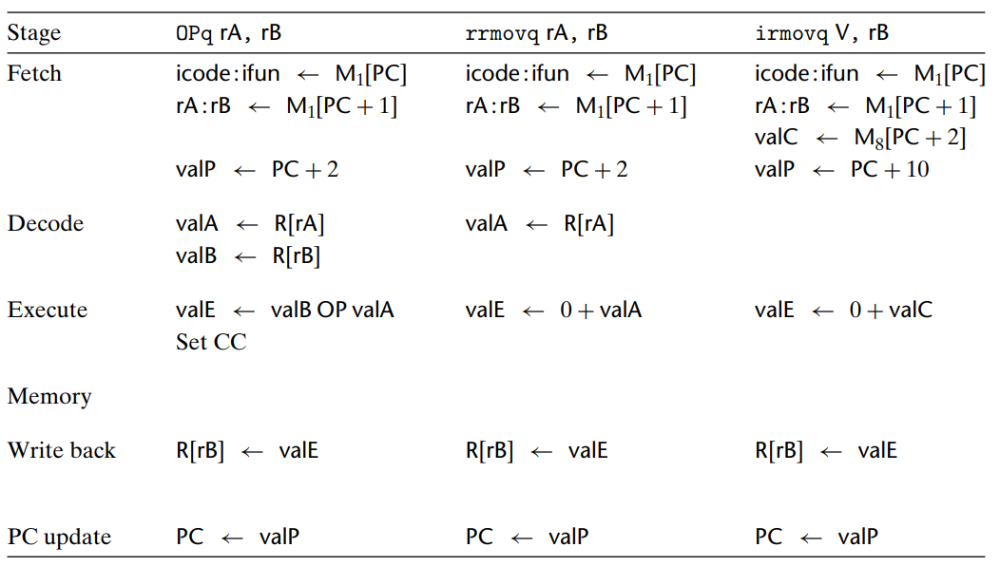

我们以 `opq` 和 `irmovq` 指令为例来说明这个过程是如何执行的

在 `Fetch` 阶段，将 `PC, PC + 1, PC + 2` 的值分别加载到不同的变量当中

* `icode` 用于辨别该指令属于哪一条指令，`ifun` 用于进行条件判断（对于条件传送和条件跳转指令而言）

* `rA` 与 `rB` 分别存储寄存器标识符，后面的 `R[rA]` 或 `R[rB]` 才会对**寄存器文件**进行访问
 
* `valC` 用于存储该指令的常数，`valP` 用于存储下一条指令的地址

在 `Decode` 阶段，会将寄存器文件当中寄存器的值加载到局部变量 `valA` 或 `valB` 中

在 `Execute` 阶段，会对数值进行计算，并将结果存放在 `valE` 中

在 `Memory` 阶段，会访问内存，读取或者写入，后面的 `push`、`ret`、`call` 指令会使用该阶段

在 `Write back` 阶段，会对寄存器文件进行写入，以更新寄存器的数值

在 `PC update` 阶段，将设置 `PC` 为下一条指令的地址，也就是 `valP` 的地址

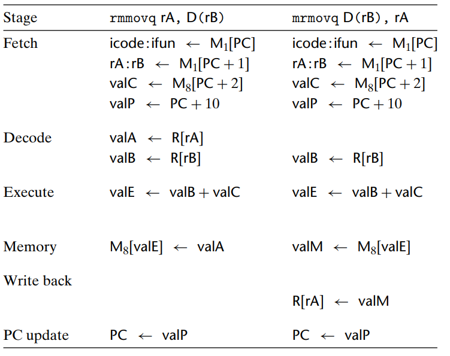

不难发现，`rmmovq` 和 `mrmovq` 的行为与上面的相同

不同的是，上面的 `valC` 存放的是立即数，这里的 `valC` 存放的是地址的偏移量

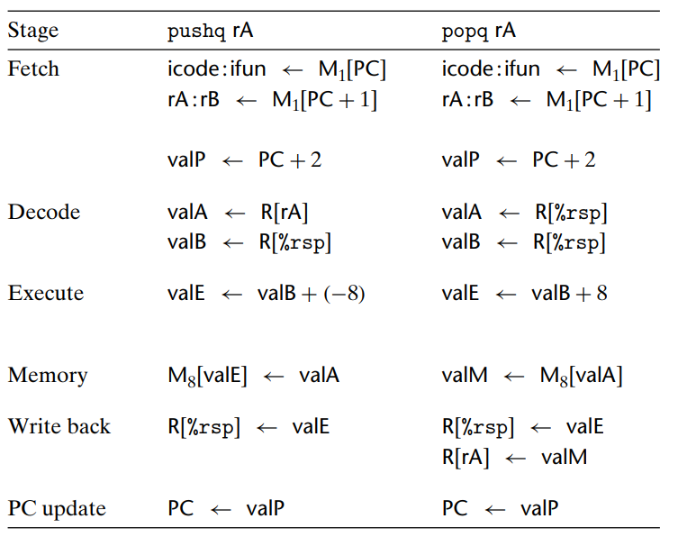

在 `pushq` 的指令的当中，我们需要将**寄存器 `rA` 与 `%rsp` 的的值加载到 `valA` 和 `valB` 当中**

之后将 `%rsp` 的值减 $8$ ，得到栈指针的新地址，随后是先对内存进行写入，再对 `%rsp` 寄存器的值进行写入

这么做是为了保证以下情况结果的确定性：

```asm
push %rsp
```

在 `x86-64` 中，这么做的结果为，会先将当中 `%rsp` 的值压入栈中，再对 `%rsp` 的值进行更新

我们设计的 `Y86-64` 的设计需要与 `x86-64` 相一致，因此在框架的设计中，`pushq` 指令需要先对内存进行写入，在对寄存器变量进行写入

在 `popq` 指令当中，我们会将 **`%rsp` 的值加载到 `rA` 和 `rB` 中**，然后我们将当前栈指针的值增加以得到新的栈指针的值，将其放在 `valE` 中

随后在内存当中对 `rA` 中存放的地址进行访问（也就是 `%rsp` 的值），将值放到 `valM` 中

在 `Write back` 阶段，是先对 `%rsp` 进行写入，再对 `rA` 进行写入

这是因为在 `x86-64` 中，指令 `popq %rsp` 的结果为：先减小栈指针，然后将新值在内存当中的值复制到 `%rsp` 中

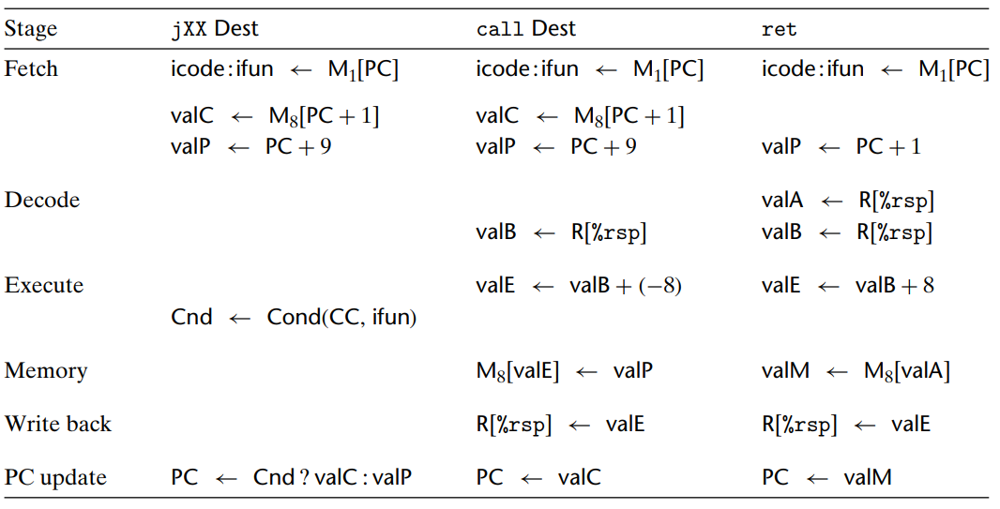

这里我们需要对三个指令的过程进行分析

* `jXX` 指令

在 `jXX` 指令中，首先将 `PC` 所指字节标记为 `icode` 和 `ifun` ，随后读取后续的 `Dest` 字段，将其标记为 `valC` ，将下一条指令的地址标记为 `valP`

在执行阶段，会根据指令功能 `ifun` 和控制码 `CC` 来设定 `Cnd` 

最后在更新的时候，依据 `Cnd` 的真假（有多个跳转条件）来判断将 `PC` 更新为 `valC` 还是 `valP`

* `call` 指令

在 `fetch` 阶段，`call` 的过程与 `jXX` 的过程相同

在后续的过程中，会将寄存器 `%rsp` 的值赋给 **`valB`**（只会用到 `valB`） ，并将 `%rsp` 的值减去 `8` 得到的值赋给 `valE`

之后，将 `valP` 压入栈中（下一条指令的地址压入栈中），随后将栈指针向下移动（这里我们可以得出栈指针指向的内存是存放内容的，因此在 `push` 指令中，是先下移栈指针，后写入内存）

然后将 `valC` 赋值给 `PC` （`Dest` 的值）

* `ret` 指令

与 `call` 指令不同的是，`ret` 会将寄存器 `%rsp` 的值复制到 `valA` 和 `valB` 中

随后将栈指针上移，得到的值赋值给 `valE`，随后将 **`valA` 处的内存赋值给 `valM` （从内存当中读取出返回地址），将栈指针的新值赋值给 `%rsp`** 

最后将 `PC` 更新为 `valM` 的值

到此为止我们发现，对于 `Y86-64` 当中所给出的任何一条指令，我们均可以在此框架下对其进行描述，往后我们根据此框架直接给出 `SEQ` (`sequence`，顺序的) 处理器中硬件的 `HDL` 描述，也就是 `SEQ` 的硬件描述

---

### SEQ 硬件结构

#### SEQ 时序

下面，我们给出 `Y86-64` 的顺序 (`SEQ`) 执行硬件结构图

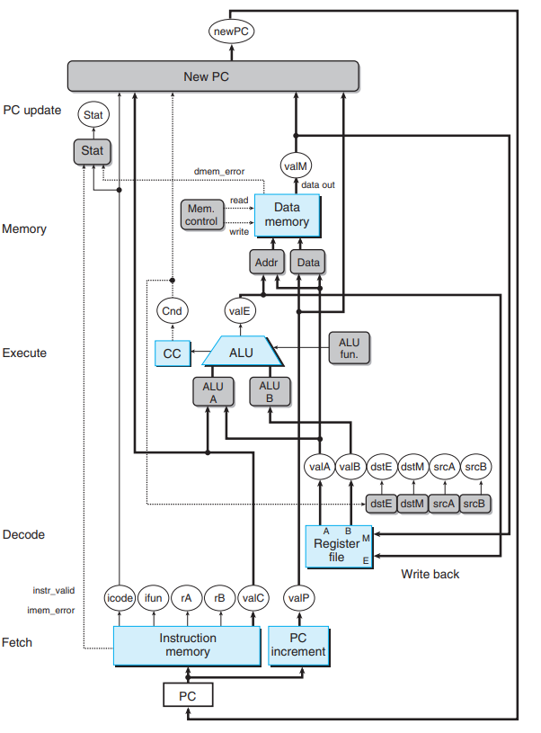

在此图中，图标含义如下：

* *`白色方框`* 表示时钟寄存器
* *`浅蓝色方框`* 表示硬件单元
* *`灰色圆角矩形`* 表示控制逻辑块
* *`白色圆圈`* 用于说明该线路的名字
* *`中等粗度的线`* 表示宽度为字长的数据
* *`虚线`* 表示单个位的数据

`SEQ` 的实现包括**组合逻辑**和两种存储器设备——时钟寄存器（程序计数器和条件码寄存器）和随机访问寄存器（寄存器文件、指令内存和数据内存）

组合逻辑实际上是堆一系列位进行操作的二进制组合逻辑门，因此组合逻辑是不需要时钟信号进行控制的。只要输入变化了，那么输出也跟着变换，这样值便可以通过组合逻辑网络进行传播

剩下的四个硬件：程序计数器、条件码寄存器、寄存器文件、数据内存则**需要依靠时钟进行控制**。在每个时钟周期中，程序计数器会加载新的地址；在执行整数运算时，会加载条件码寄存器；在执行 `rmmovq, pushq, call` 时，会写入数据内存；我们也可以在一个时钟周期内对寄存器文件的两个写端口进行写入或从两个读端口进行读取

我们根据下面的图来说明这个过程

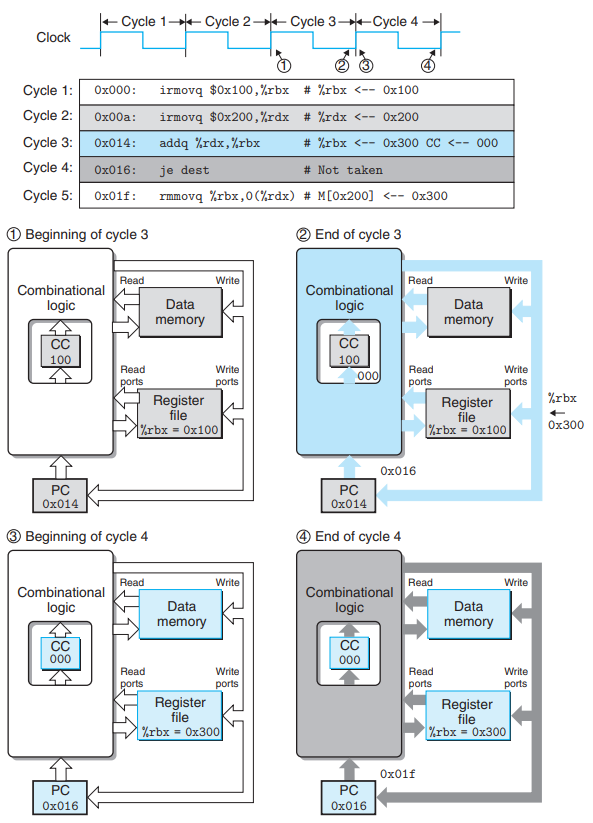

我们发现，**每一个时钟周期执行一条指令**，该指令的执行则依赖于背后的硬件之间的顺序配合

在周期三开始时，**组合逻辑用白色表示，状态单元用灰色表示**，此时状态单元中的值位周期二结束之后的值，`PC` 的值为第三条指令的地址（代表本次循环开始）

周期三开始时，组合逻辑会开始计算数值（此时为白色）。当周期三结束时，组合逻辑已经得到了新值（用蓝色表示，得到新条件码 `000`、新 `PC`、新寄存器值），但此时**状态单元的值并没有被更新**（时钟上升沿没到）

当周期四开始的时候，**状态单元得到更新**（时钟上升沿到来）但**组合逻辑还没有对改变化做出反应**（用白色表示）。程序计数器从新值开始执行指令，组合逻辑再次开始计算数值。当数值计算完毕后，到周期四的末尾，**组合逻辑已经计算完毕**（用灰色表示）但**状态单元还没有得到更新**（需要依靠下一个时钟上升沿）

也就是说，**数值会通过组合逻辑进行计算和传播**，**状态的更新则需要依靠时钟信号**（依靠时钟上升沿）

---

#### SEQ 各阶段的实现

在这里我们会给出实现 `SEQ` 中各个硬件控制块的 `HCL` 描述

> 注：**此部分需要结合前面图 `stage_1` 到 `stage_4` 进行分析**

下面是 `HCL` 中对于指令的宏描述，我们使用宏来替代指令的字节级编码，这样在使用硬件语言描述时可读性更强

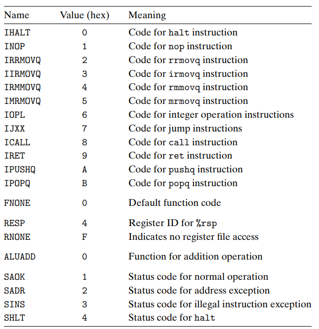

* `Fetch` 阶段

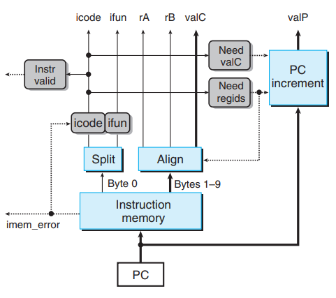

以 `PC` 的值作为第一字节，该单元会依据不同的指令读取 $1$ 到 $10$ 个字节，由于 `fetch` 阶段所做行为我们在前面已经叙述，这里我们主要说明几个 `bool` 数的含义

`instr_valid`：用于表示该字节是否为一个合法的 `Y86-64` 的指令编码

`need_regids`：该指令是否包含寄存器指示符字节

`need_valC`：该指令是否包含常数

> 如果 `PC, need_regids, need_valC` 的值分别为 $p,r,i$ ，那么下一条指令的地址为：$p+1+r+8i$ 

下面为 `need_regids` 和 `need_valC` 的 `HCL` 描述

```HCL
bool need_regids = 
    icode in { IRRMOVQ, IOPQ, IPOPQ, IIRMOVQ, IRMMOVQ, IMRMOVQ };

bool need_valC = 
    icode in { IIRMOVQ, IRMMOVQ, IMRMOVQ, IJXX, ICALL };
```

* `Decode` 和 `Write back` 阶段

由于这两个阶段都需要访问寄存器文件，因此将二者合在一起

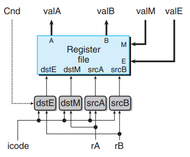

`valA` 和 `valB` 为读取寄存器得到的数值，`valM` 和 `valE` 为向寄存器写入的数值（分别从内存和计算得到）

`srcA` 和 `srcB` 表示读端口的地址输入，`dstE` 和 `dstM` 为写端口的地址输入

**`srcA` 表示应该读取那个寄存器以得到 `valA`**，**`srcB` 表示应该读取那个寄存器以得到 `valB`** ，其 `HCL` 描述如下：

```HCL
word srcA = [
    icode in { IRRMOVQ, IRMMOVQ, IOPQ, IPUSHQ } : rA; 
    icode in { IPOPQ, IRET } : RRSP; # 栈指针
    1 : RNONE; # 不需要寄存器
];

word srcB = [
    icode in { IOPQ, IRMMOVQ, IMRMOVQ } : rB;
    icode in { IPUSHQ, IPOPQ, ICALL, IRET } : RRSP;
    1 : RNONE;
];
```

**`dstE` 表示写端口 `E` 的目的寄存器，`valE` 的值将会存放在该寄存器中**，**`dstM` 表示写端口 `M` 的目的寄存器，`valM` 的值将会存放在该寄存器中**，其 `HCL` 描述如下：

```HCL
word dstE = [
    icode in { IRRMOVQ } && cnd : rA; # cmovxx 的代码为 IRRMOVQ，也就是条件传送
    icode in { IIRMOVQ, IOPQ } : rB;
    icode in { IPUSHQ, IPOPQ, ICALL, IRET } : RRSP;
    1 : RNONE;
];

word dstM = [
    icode in { IMRMOVQ, IPOPQ } : rA;
    1 : RNONE;
];
```

注意到，指令 `popq` 会用到寄存器的两个写端口，而对于指令 `popq %rsp`，两个写端口会用到同一个地址，因此我们需要规定二者的优先级以保证结果的正确性

`popq` 会先将旧值放入 `%rsp` 中，再对栈指针减小，因此**写端口 `M` 的优先级要高于写端口 `E`**。这是因为旧值需要从内存当中读出，栈指针减小的值则是通过计算得出

* `Execute` 阶段

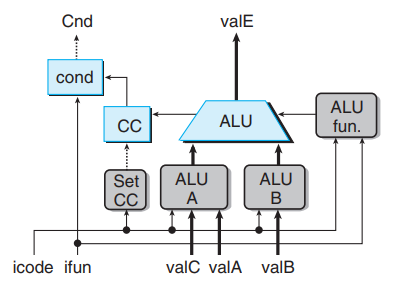

此单元会根据 `alufun` 信号，对两输入数据 `alua` 和 `alub` 执行 `ADD, SUBTRACT, AND, EXCLUSIVE-OR` 运算

我们知道，`alua` 值的来源只能为：`valA, valC, 8, -8`，`alub` 值的来源只能为：`valB, 0`，因此二者的 `HCL` 描述如下：

```HCL
word alua = [
    icode in { IRRMOVQ, IOPQ } : valA;
    icode in { IIRMOVQ, IRMMOVQ, IMRMOVQ } : valC;
    icode in { ICALL, IPUSHQ } : -8;
    icode in { IRET, IPOPQ } : 8;
];

word alub = [
    icode in { IRMMOVQ, IMRMOVQ, IOPQ, IPUSHQ, IPOPQ, ICALL, IRET } : valB;
    icode in { IRRMOVQ, IIRMOVQ } : 0;
];
```

`ALU` 单元通常被用作加法器使用，当指令为 `opq` 时才会执行其他运算，因此 `alufun` 的 `HCL` 描述如下：

```HCL
word alufun = [
    icode == OPQ : ifun;
    1 : ALUADD;
];
```

`ALU` 在计算时会产生条件码 `CC`（只有在执行 `opq` 指令时才会），因此我们需要一个信号 `set_cc` 来控制是否需要更新条件码寄存器：

```HCL
word set_cc = icode in { OPQ };
```

标记为 `cond` 的单元会根据条件码 `cc` 和功能码 `ifun` 来产生信号 `Cnd` ，该信号用于条件跳转与条件传送

* `Memory` 阶段

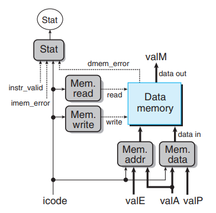

`Mem.read` 和 `Mem.write` 表明该执行读操作还是执行写操作，其 `HCL` 表示为：

```HCL
bool mem_read = icode in { IMRMOVQ, IPOPQ, IRET };

bool mem_write = icode in { IRMMOVQ, IPUSHQ, ICALL };
```

`Mem.addr` 和 `Mem.data` 表示内存地址和待写入的内存数据，`valM` 为从内存中读出的数据。对内存进行读和写的**地址**总是放在 `valE` 和 `valA` 中，对内存进行读和写的**数据**总是放在 `valA` 和 `valP` 中，二者 `HCL` 表示为：

```HCL
word mem_addr = [
    icode in { IRMMOVQ, IPUSHQ, ICALL, IMRMOVQ } : valE;
    icode in { IPOPQ, IRET } : valA;
];

word mem_read = [
    icode in { IRMMOVQ, IPUSHQ } : valA;
    icode in { ICALL } : valP;
];
```

* `PC update` 阶段

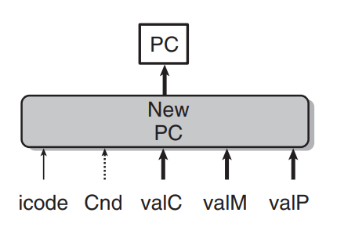

`SEQ` 的最后一个阶段会更新 `PC` 的值，根据 `icode` 和 `Cnd`，新 `PC` 的值可能为 `valC`、`valM` 和 `valP`，其 `HCL` 描述如下：

```HCL
word new_pc = [
    icode == ICALL : valC;
    icode == IJXX && Cnd : valC;
    icode == IRET : valM;
    1 : valP;
];
```

到此，我们用 `HCL` 描述了一个硬件 `SEQ` 框架，每一条指令的执行都可以被分成五个阶段进入我们的 `SEQ` 框架中。但有一个问题是，这个 `SEQ` 太慢了，在此框架中，我们必须等五个阶段全部执行完，时钟才能进行更新。这是因为，每次时钟到来都会更新 `PC` ，如果在此之前没有将 `PC` 的值计算出来，就会导致整个系统崩溃，这是我们不愿看到的

要提高此 `SEQ` 处理器的速度，我们需要引入流水线 `pipelining` 的概念

### Pipelining 的通用原理

