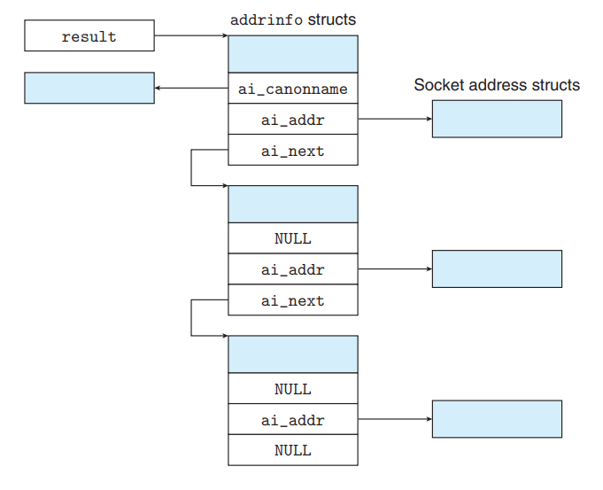

# 网络编程

- [网络编程](#网络编程)
  - [Basic concepts](#basic-concepts)
  - [Main function](#main-function)
    - [socket \& listen](#socket--listen)
    - [connect](#connect)
    - [bind \& accept](#bind--accept)
  - [Conversion between host and service](#conversion-between-host-and-service)
    - [getaddrinfo](#getaddrinfo)
    - [getnameinfo](#getnameinfo)


## Basic concepts

主机 `host` 指计算机设备，这包括客户端和服务器或者其他网络设备，主机可以通过主机名（也叫域名） `host name` 或者 `IP` 地址 `IP address` 进行标识。每台主机都有本地域名 `localhost`，用 `IP` 地址 `127.0.0.1` 进行标识，这被称为回环地址 `loopback address`

服务 `server` 指网络中提供特定服务的应用程序，服务通常是预定义的，按照约定来命名。例如：`http` 是 `HTTP` 协议的服务名，用于标识 `Web` 服务器的默认端口 `80`，`ftp` 为 `FTP` 协议的服务名，用于标识 `FTP` 服务器的默认端口号 `21`（我们可以认为，服务名与端口号等价）

> 注：特定的主机名和服务名可能对应多个网络地址（`<IP, port>` 对）。比如，一台主机下可能会有多个网络接口，那么每个接口都会有一个独特的 `IP` 地址；或者一台主机上运行多个服务，那么每个服务都会有一个端口号。这便是为什么 `getaddrinfo` 函数会返回一个网络地址链表的原因

`IP` 地址是一个 `32` 位无符号整数，用**大端字节序**存储，定义如下：

```c
struct in_addr {
    uint32_t s_addr;//big-endian
}
```

网络字节序 `network byte order` **固定**为大端字节序，而主机字节序 `host byte order` 则不确定（但通常为小端字节序），以下四个函数提供二者之间的转换：

```c
#include <arpa/inet.h>

uint32_t htonl(uint32_t hostlong);
uint16_t htons(uint16_t hostshort);

uint32_t ntohl(uint32_t hostlong);
uint16_t ntohs(uint16_t hostshort);
```

这个函数有 `16` 位的版本，也有 `32` 位的版本，但没有 `64` 位的版本

`IP` 地址通常可以用点分十进制 `detted-decimal notation` 表示，以下两个函数用于将 `16` 进制的 `IP` 地址转化为点分十进制表示：

```c
#include <arpa/inet.h>

//success return 1, sec illeague return 0, another error return -1
int inet_pton(AF_INET, const char* src, void* dst);

//if success, will pointe to string which is detted-decimal notation
const char* inet_ntop(AF_INET, const char* src, socklen_t size);
```

这些函数中 `n` 代表网络 `network`，`p` 代表表示方法 `presentation`；`AF_INET` 表示 `IPv4`，`AF_INET6` 表示 `IPv6`

`inet_pton` 将一个 `src` 指向的点分十进制字符串转化为二进制网络字节顺序的 `IP` 地址；`inet_ntop` 将一个 `src` 指向的二进制网络字节顺序的 `IP` 地址转化为点分十进制表示的字符串，并以 `NULL` 结尾

* 二进制转十进制：`0x8002c2f2 -> 128.2.194.242`

套接字 `socket` 是连接的一个**端点**，每个套接字都有一个**套接字地址** `socket address` ，用 `address : port` 表示

当客户端请求一个连接时，客户端套接字地址当中的端口号为内核分配的临时端口 `ephemeral port`，而服务器的端口号则为知名端口，`Web` 服务器为 `80`，邮件服务器为 `25`

一个连接有两端的套接字地址唯一确定，这被称为套接字对，即：`(client_address : client_port, server_address : server_port)`

对于 `Linux` 内核而言，套接字是通信的一个端点；对于应用级程序员而言，套接字则是一个有着相应文件描述符的文件

> `Linux` 当中每个文件都有一个类型：
> * `regular file` 普通文件：应用程序会区分文本文件 `text file` 和二进制文件 `binary file`，但对内核而言二者没有区别
> 
> * `diretcory` 目录：目录是包含一组链接 `link` 的文件，每个链接既可以映射到一个文件，也可以映射到目录。一个目录至少包含两个文件：`.` 对于自身的引用和 `..` 对于父目录的引用
> 
> * `socket` 套接字：用于网络编程；`block device` 块设备；`symbolic link` 符合链接，也就是软链接；命名通道 `named pipe`

一个套接字地址存放在类型为 `sockaddr_in` 的结构体中，此结构体大小**固定为 `16` 字节**，`sin_family` 表示 `AF_INET`，`sin_port` 是一个 `16` 位的端口号，`sin_addr` 是一个 `32` 位的 `IP` 地址，`sin_zero` 填充剩余字节以满足总大小为 `16` 的要求

```c
struct sockaddr_in {
    uint16_t    sin_family;
    uint16_t    sin_port;
    uint32_t    sin_addr;
    unsigned char sin_zero[8];
};
```

在老的代码中，由于没有 `void*` 这个通用指针，因此我们需要一个通用的指针来指向不同协议的套接字，这个问题的解决是将 `sockaddr` 结构体指针强制转化成一个通用的结构体指针（这也是为什么这个结构体要强制 `16` 字节对齐的原因）：

```c
struct sockaddr {
    uint16_t    sa_family;
    char        sa_data[14];
};
//usually use SA instead of struct sockaddr
typedef struct sockaddr SA;
```

## Main function

### socket & listen

> 此处涉及的函数有五个：`socket, connect, bind, listen, accept`
>
> 客户端需要使用的函数为：`socket, connect`
>
> 服务端需要使用的函数为：`socket, bind, listen, accept`

客户端和服务端通过 `socket` 函数来创建一个套接字描述符 `socket descriptor`（在 `Linux` 中，套接字本身也是文件）：

```c
#include <sys/types.h>
#include <sys/socket.h>
//if success, return nonnegtive, else return -1
int socket(int domain, int type, int protocol);
```

参数含义如下：

* 地址族 `domain`：指定套接字的地址族，或者称为协议族，用于定义该套接字的**地址格式**和**通信域**
  * `AF_INET`：`IPV4` 地址族，用于指定 `IPV4` 协议，下同
  * `AF_INET6`：`IPV6` 地址族
  * `AF_UNIX`：`UNIX` 地址族，用于本地进程间的通信
* 套接字类型 `type`：指定套接字类型，用于定义该套接字**以何种方式进行通信**
  * `SOCK_STREAM`：**面向连接的琉套接字**，用于提供**可靠的、有序的、双向的字节流**（`TCP` 使用）
  * `SOCK_DGRAM`：**面向数据包的套接字**，用于提供**不可靠的、无连接的数据传送**（`UDP` 使用）
* 协议 `protocol`：指定套接字所使用的运输协议，通常将其设置为 `0`，这样可以使其自动选择

使用方式如下：

```c
clientfd = socket(AF_INET, SOCK_STREAM, 0);
```

这样就创建的是**客户端套接字**，该套接字使用 `IPV4` 协议（地址为 `32` 位）和 `TCP` 建立连接

需要说明的是，在使用 `socket` 时默认创建的是客户端套接字，客户端用该套接字发出请求，因此对于内核而言，`socket` 函数创建的套接字对应于主动套接字 `active socket`。由于服务器需要监听客户端的请求，因此其套接字为监听套接字 `listening socket`（或者称为被动套接字 `passive socket`），为了创建该套接字，我们需要用 `listen` 函数来转变此套接字

```c
#include <sys/socket.h>

int listen(int sockfd, int backlog)
```

`listen` 函数将 `sockfd` 从一个 `active socket` 转变为 `listening socket`，而 `backlog` 表示**等待连接队列中可以保存的最大未完成连接数**。未完成连接是指已经接收到连接请求，但尚未通过调用 `accept` 函数接受的连接。当等待连接队列已满时，新的连接请求可能会被拒绝

### connect

对于客户端而言，可以调用 `connect` 函数于服务器建立连接

```c
#include <sys/socket.h>
//return 0 if success, -1 on error
int connect(int clientfd, const struct sockaddr* addr, socklen_t addrlen)
```

前面我们说到，`sockaddr` 是一个通用的套接字结构体，用于存储套接字地址（`IP` 地址和端口号）和协议，这里的**套接字地址就是服务器的套接字地址**，而 `addrlen` 为 `sizeof (sockaddr)`，即该结构体的长度

`connect` 函数会阻塞，直到成功建立套接字或者发生错误。一旦成功建立与服务器的连接，那么此时的连接便可以由套接字对 `(x : y, addr.sin_addr : addr.sin_port)` 进行描述。其中 `x` 表示客户端的 `IP` 地址，`y` 表示由内核分配的临时端口

### bind & accept

对于服务器而言，需要将**调用 `socket` 函数得到的套接字描述符与其本身的套接字地址（也就是服务器套接字地址）相关联**，此时会用到 `bind` 函数

```c
#include <sys/socket.h>
//return 0 if success, -1 on error
int bind(int sockfd, const struct sockaddr* addr, socketlen_t addrlen)
```

到此为止，我们知道：

* 客户端通过调用 `socket` 函数得到套接字描述符，通过 `connect` 函数与服务器套接字地址建立连接

* 服务器通过调用 `socket` 函数得到套接字描述符，通过调用 `listen` 函数将该套接字描述符从主动套接字 `active socket` 转换为被动套接字 `passive socket`，然后调用 `bind` 将该套接字描述符与服务器套接字地址相关联（服务器套接字地址也就是服务器的 `IP` 和端口号）

因此，对于服务器而言，上述工作均为准备工作（我们得到了监听描述符 `listenfd`（也可以称为被动描述符 `passivefd`）），之后还需要通过调用 `accpet` 函数来与客户端建立连接

```c
#include <sys/socket.h>
//return nonnegtive descriptor if success, -1 on error
int accpet(int listenfd, struct sockaddr* addr, int* addrlen)
```

`accept` 函数等待客户端的连接请求到达监听描述符 `listenfd`，然后**将 `addr` 填写为客户端的套接字地址**，并返回一个已连接描述符 `connected descriptor`。监听描述符只会被创建一次，并存在于整个服务器的生命周期，它是客户端「发起请求」的一个端点。已连接描述符是客户端和服务器「已经建立的连接」的一个端点，它只存在于客户端和服务器通信的过程中

也就是说，客户端第一次会与 `listen descriptor` 进行通信，随后的过程将与 `connected descriptor` 进行通信

## Conversion between host and service

### getaddrinfo

`Linux` 提供了一个强大的函数 `getaddrinfo` ，用于实现**套接字地址结构体**与**主机和服务**之间的转化

> 正如我们在开头所言，主机表示 `IP` 地址，服务表示端口号 `port`，因此该函数可以用于实现「将服务器 `IP` 地址和端口号转化为服务器套接字地址」和「将客户端 `IP` 地址和端口号转化为客户端套接字地址」

相关函数定义如下：

```c
#include <sys/types.h>
#include <sys/socket.h>
#include <netdb.h>

//Returns: 0 if OK, nonzero error code on error
int getaddrinfo(const char *host, const char *service, const struct addrinfo *hints, struct addrinfo **result);

//Returns: nothing
void freeaddrinfo(struct addrinfo *result);

//Returns: error message
const char *gai_strerror(int errcode);
```

对于给定的 `host` 和 `service`，`getaddrinfo` 将返回 `result`，`result` 是一个指向 `addrinfo` 结构的链表的指针，在该链表中，每一个节点都是一个对应于 `host` 和 `service` 的套接字地址



`addrinfo` 结构的定义如下：

```c
struct addrinfo {
    int ai_flags;              // 地址标志
    int ai_family;             // 地址家族
    int ai_socktype;           // 套接字类型（SOCK_STREAM或SOCK_DGRAM）
    int ai_protocol;           // 协议
    size_t ai_addrlen;         // 地址长度
    struct sockaddr* ai_addr;  // 地址信息
    char* ai_canonname;        // 规范名
    struct addrinfo* ai_next;  // 下一个 addrinfo 结构的指针
};
```

前两个参数的大致用法如下：

若客户端需要调用 `getaddrinfo`，则**需要指定服务器的主机名（`IP` 地址或者域名均可以）和服务**，也就是需要填写 `host` 和 `service`

在客户端调用 `getaddrinfo` 之后，需要遍历该链表，依次尝试每个套接字地址，直到成功调用 `connect` 为止（`connect` 函数中的第二个参数需要服务器的套接字地址，用 `getaddrinfo` 可以直接将服务器的 `IP` 地址和端口号转化为套接字地址结构体）

若服务器需要调用 `getaddrinfo`，**只需要指定服务**，也就是只需要填写 `service`，而 `host` 设置为 `NULL`，标识忽略主机名的解析

在服务器调用 `getaddrinfo` 之后，同样需要遍历该链表，依次尝试每个套接字地址，直到 `bind` 成功（`bind` 函数需要将服务器套接字地址与监听套接字描述符相对应）

> 因此，对于 `getaddrinfo` 的前两个参数的使用，归纳如下：
>
> `host` 和 `service` 二者都可以指定为 `NULL`，但不允许同时为 `NULL`
>
> 当 `host` 为 `NULL` 时，解析对象的主机名为当前主机，然后根据不同的 `service` 来得到不同的套接字地址（此时 `service` 已指定）。例如：`getaddrinfo(NULL, "http", &hints, &result)` 将返回当前主机下 `http` 服务的套接字地址
>
> 当 `service` 为 `NULL` 时，解析对象的主机名由 `host` 指定，那么将会获取对应主机的默认服务，进而得到不同的套接字地址。例如：`getaddrinfo("www.example.com", NULL, &hints, &result)` 将会返回 `www.example.com` 的默认服务（`HTTP` 或 `FTP` 等）的套接字地址

由于 `result` 为一个链表，因此我们需要调用 `freeaddrinfo` 来将该链表进行释放。如果调用 `getaddrinfo` 得到非零的错误码，可以通过调用 `gai_strerror` 来得到相应的错误字符串

第三个参数 `hints` 是一个 `addrinfo` 结构，用于控制 `result` 所指向的链表的各个节点内容。如果要对 `hints` 进行设置，**我们只能修改以下四个字段**：

* `ai_family`：用于控制 `getaddrinfo` 返回的套接字地址是 `IPV4` 格式还是 `IPV6` 格式，前者用 `AF_INET` 指定，后者用 `AF_INET6` 指定
* `ai_socktype`：用于控制 `socket` 的类型，一般指定为 `SOCK_STREAM`
* `ai_flags`：用于修改一些默认行为，可以通过按位与运算将多个掩码进行叠加
  * `AI_ADDRCONFIG`：一般推荐使用该掩码，表示当主机被配置为 `IPV4` 时，`getaddrinfo` 则返回 `IPV4` 的地址，对于 `IPV6` 也同理
  * `AI_CANONNAME`：设置该掩码则会将 `result` 指向的链表的第一个节点的 `ai_canonname` 指向 `host` 的权威名字（一般不用这个）
  * `AI_NUMERICSERV`：`getaddrinfo` 的参数 `service` 既可以是端口号也可以是服务号，该掩码强制 `service` 为端口号
  * `AI_PASSIVE`：服务器设置该掩码。`getaddrinfo` 得到的套接字默认为 `active socket`，设置该掩码后得到的套接字默认为 `passive socket`
* `ai_protocol`：等价于 `socket` 函数中的第三个参数 `potocol`，一般设置为 `0` 即可

在使用 `hints` 时，我们通常先用 `memset` 将其设置为 `0`，然后再对其进行设置

### getnameinfo

与 `getaddrinfo` 相反的函数为 `getnameinfo`，该函数将套接字地址（包含 `IP` 地址和端口号）转化为主机名和服务名

```c
#include <sys/socket.h>
#include <netdb.h>

//Returns: 0 if OK, nonzero error code on error
int getnameinfo(const struct sockaddr *sa, socklen_t salen,
                char *host, size_t hostlen,
                char *service, size_t servlen, int flags);
```

`sa` 指向大小为 `salen` 字节的套接字地址结构体，`host` 指向大小为 `hostlen` 字节的缓冲区，`service` 指向大小为 `servlen` 字节的缓冲区，参数 `flags` 是一个位掩码，用于修改一些默认行为：

* `NI_UNMERICHOST`：主机地址的返回以数值形式而不是域名形式
* `NI_NUMERICSERV`：端口号的返回以数值形式而不是服务名

