# Transport Layer

- [Transport Layer](#transport-layer)
  - [Multiplexing \& Demultiplexing](#multiplexing--demultiplexing)
    - [Not connection-oriented](#not-connection-oriented)
    - [Connection-oriented](#connection-oriented)
    - [Issue of TCP connection](#issue-of-tcp-connection)
  - [Principle of Reliable Data Transfer](#principle-of-reliable-data-transfer)
    - [rdt1.0](#rdt10)
    - [rdt2.0](#rdt20)
      - [rdt2.1](#rdt21)
      - [rdt2.2](#rdt22)
    - [rdt3.0](#rdt30)
  - [RDT with Pipelining](#rdt-with-pipelining)
    - [Go-Back-N (GBN)](#go-back-n-gbn)

## Multiplexing & Demultiplexing

UDP acts as not connection-oriented whereas TCP acts as connection-oriented, there are some subtle difference between them.

### Not connection-oriented

The network layer is responsible for *logical connection* between host-to-host, whereas the transport layer is responsible for *logical connection* between process-to-process. Therefore, when transport layer receives a packet from the layer below, it must deliver this packet to proper process

The **IP address** is used to directing packets to correct host in network layer, while **port number** is used to delivering packets to proper process.

A typical transport layer segment is as below:

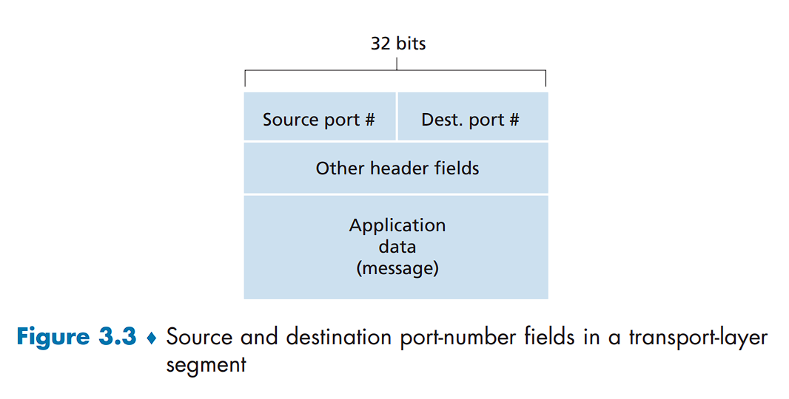

The source port number is used for the destination host to send packets back to source host.

The UDP socket only can be identified by port number. Therefore, if there are multiple client hosts with various IP address send packets to the same server host, the application running with a UDP socket can't distinguish between different clients.

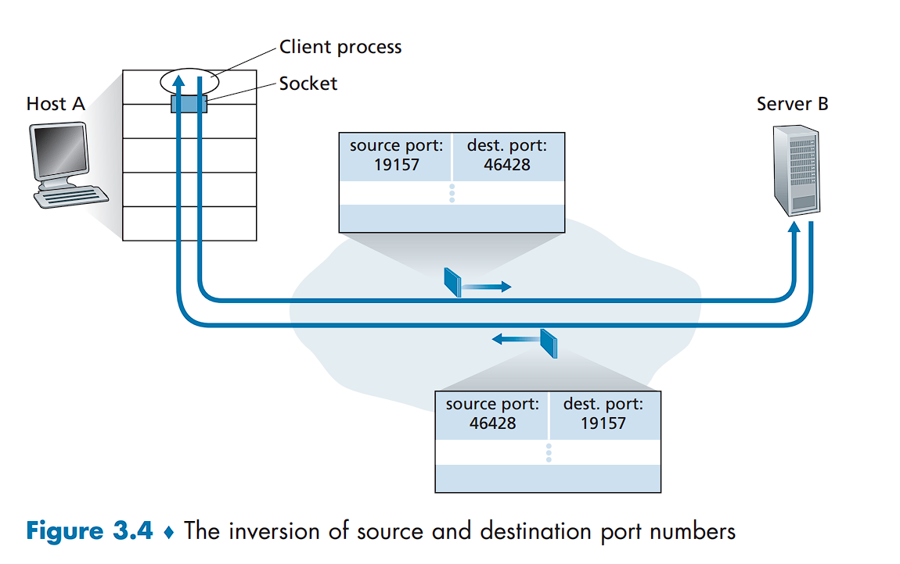

Moreover, UDP just consists of multiplexing/demultiplexing and checksum. It's typical strcuture is as below:

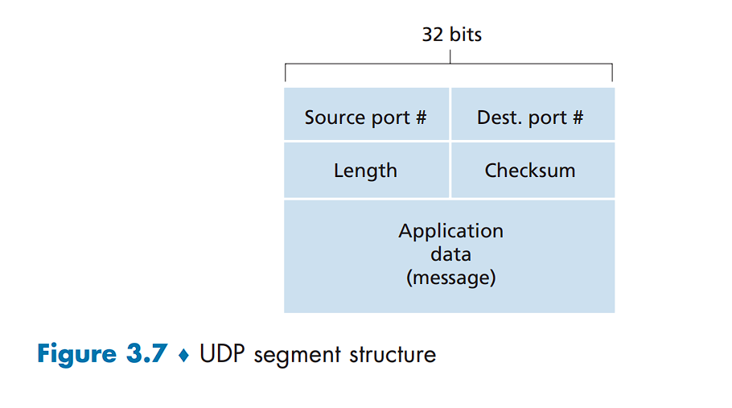

The length field specifies the number of bytes in the UDP segment(header plus data).

### Connection-oriented

TCP is connection-oriented, so its socket consists of four part: **source port number**, **source IP address**, **destination port number** and **destination IP address**. So as for the former case, the application running in server host can distinguish different clients by unique TCP socket.

### Issue of TCP connection

At times of TCP connection establishment, all processes running on different clients establish a  connection with server by using the hostname and well-known port. A TCP socket in client first connects with TCP socket in server, usually refered to as the "welcome socket", whose src IP and src port is server IP and well-known port respectively, but dest IP and dest port both is empty.

Secondly, after three-way handshake, the new socket is created, usually referred to as the client socket, which serves to send and receive packets between the server and the specified client, while the "welcome socket" acts to establish connection. The newly created socket(client socket) has client's IP and port and server's IP and port

Due to some fields of the "welcome socket" being empty while client socket isn't, so transport layer can distinguish them.

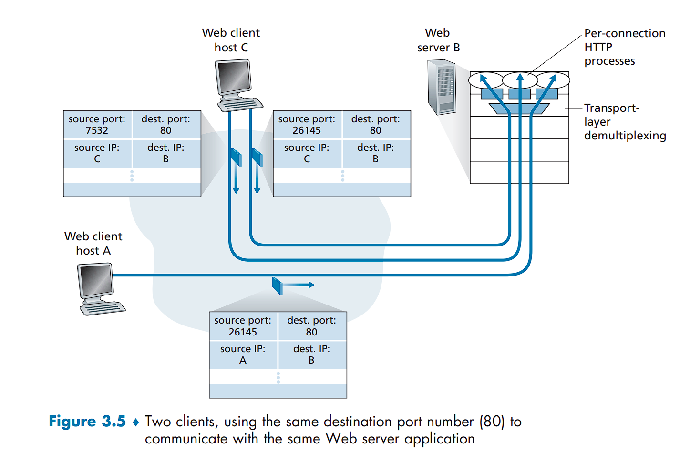

## Principle of Reliable Data Transfer

At this point, we only introduce a series of protocol from rdt1.0 to rdt3.0

Firstly, the definition of a finite-state machine(FSM) is given:

- Each cycle represents a state 
- The arrow indicates the transition from one state to another 
- The event causing the transition is shown above the horizontal line, and the actions taken when event occur are shown below the horizontal line
- The initial state of FSM is indicated by the dashed arrow
- When no event occur or no actions taken on event occurs, we use symbol $\wedge$ below or above horizontal line

### rdt1.0

Assumption:

- underlying channel is completely reliable

FSM:

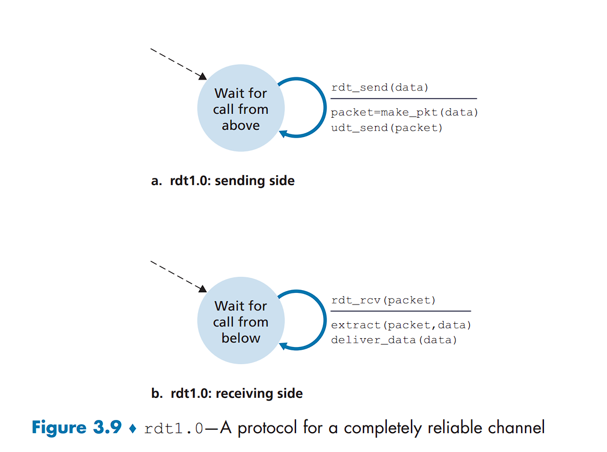

### rdt2.0

Assumption:

- underlying channel is one in which bits in the packet may be corrupted

Firstly, we need a way to detect whether there are bits error in the packet received on receiving side. Secondly, if the packet received by receiver is corrupted, the sender should retransmit, otherwise shouldn't.

Essentially, three additional mechanism are required in rdt1.0

- *Error Detection*: This allows receiver to detect whether there are bit errors in received packet
- *Receiver Feedback*: It consists of *positive acknowledgement(ACK)* and *negative acknowledgement(NAK)*. If sender receives NAK or ACK, it should retransmit last packet or transmit next packet, respectively
- *Retransmission*: A packet received in error at receiver should be retransmitted

FSM:

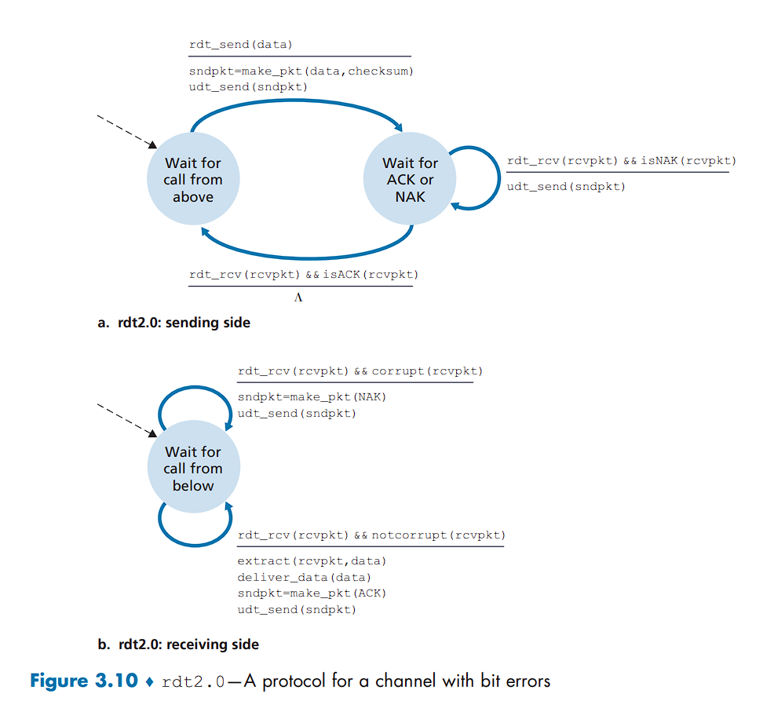

Noted that sender will not send a new piece of data until it is sure that receiver is correctly receive the current packet, so protocol such as rdt2.0 is referred to as **stop-and-wait** protocol

#### rdt2.1

Unfortunately, there is a slight oversight in rdt2.0. We can't account for the possibility that the ACK or NAK may be corrupted. That is, if the sender receives a ACK or NAK corrupted in the intermideate channel, it can't respond correctly.

An intuitive way to solve this problem is that when the ACK or NAK is corrupted, the sender simply retransmit the current packet and receiver should determine whether the current packet is idnetical to the one received before(i.e., whether the current packet is duplicate). To address the second problem, we can add a **sequence number** into packets.

FSM:

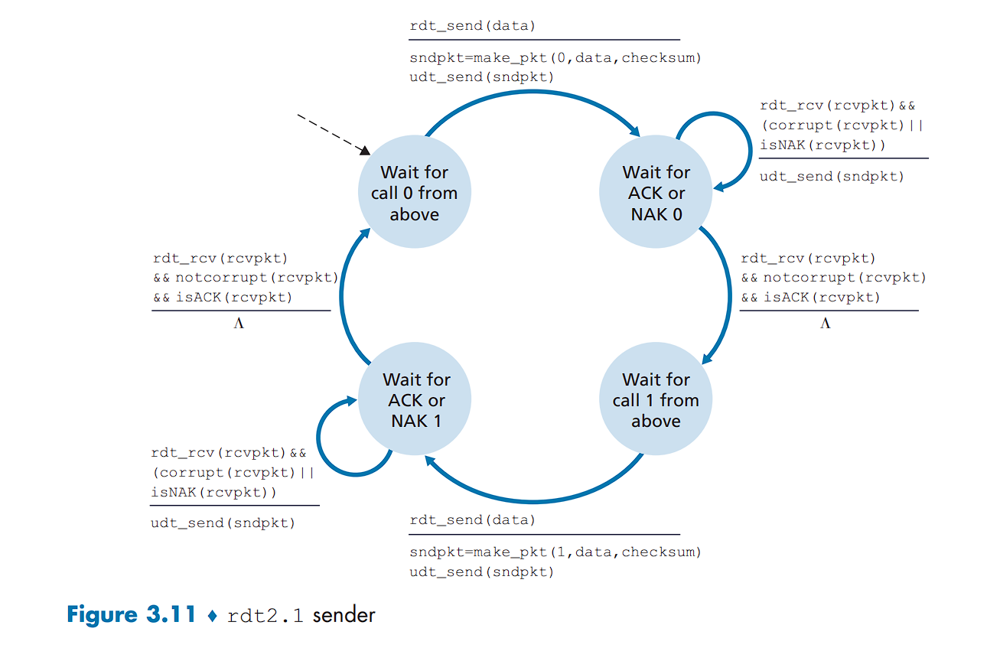

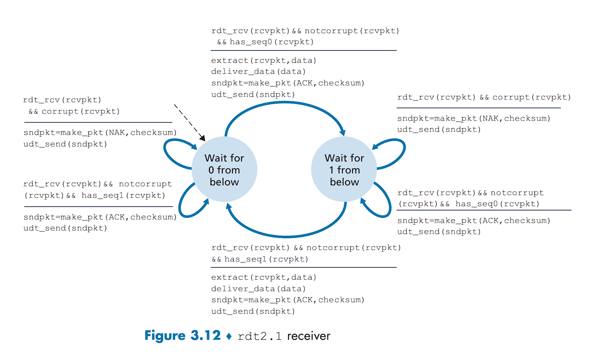

#### rdt2.2

We can accomplish the same effect as a NAK, instead of sending NAK, if we only send ACK for **last correctly received packet**. The sender that receive duplicate ACK with the same sequence number, knows current packet is corrupted in the intermediate channel. Consequently the sender only needs to retransmit the current packet to receiver. In other words, the sender knows the receiver not correctly receives packet following the packet that is being ACKed twice.

FSM: 

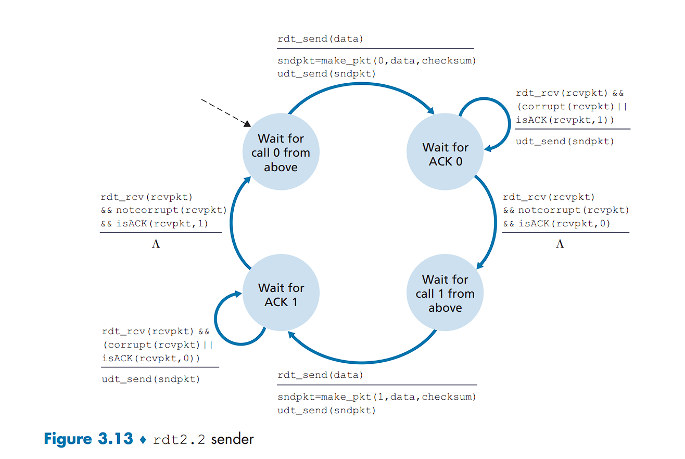

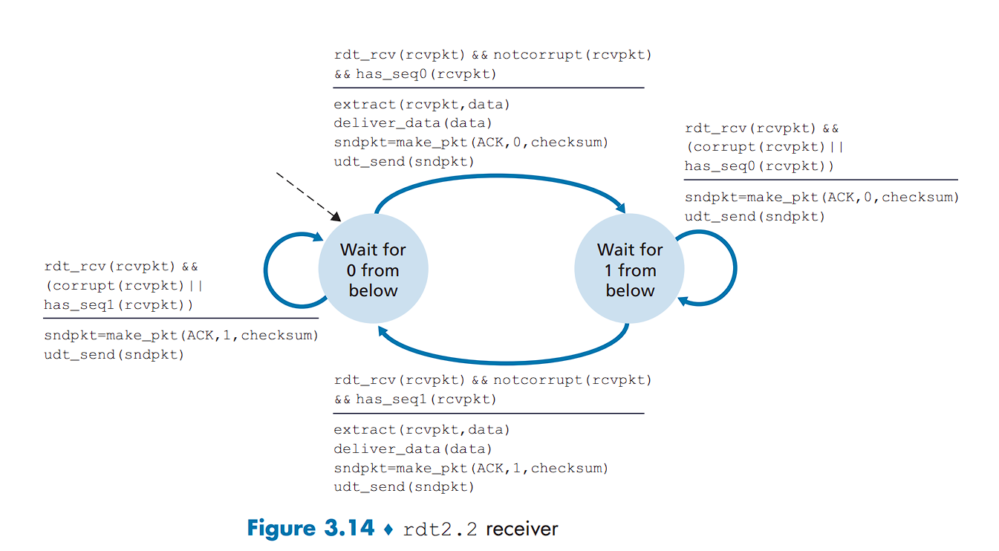

### rdt3.0

Assumption:

- In addition to corrupting bits, the underlying channel can **lose** packet as well

From the sender's standpoint, retransmission is a panacea. Therefore, when a lose event occurs, we require a **countdown timer** to inform sender to retransmit the lost packet.

Essentially, with a channel that can corrupt and lose packets, we can place the burden of informing sender to retransmit when timer has expired on either the sender or the receiver.

FSM:

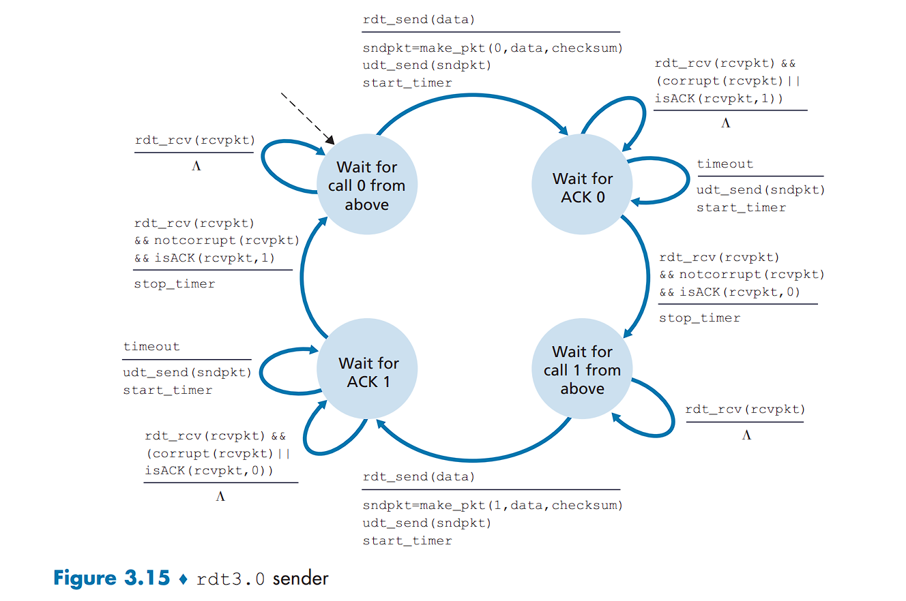

Because the sequence numbers alternate between 0 and 1, protocol rdt3.0 is sometimes known as the **alternating-bit protocol**.

The following figure shows how rdt3.0 operates in different scenario:

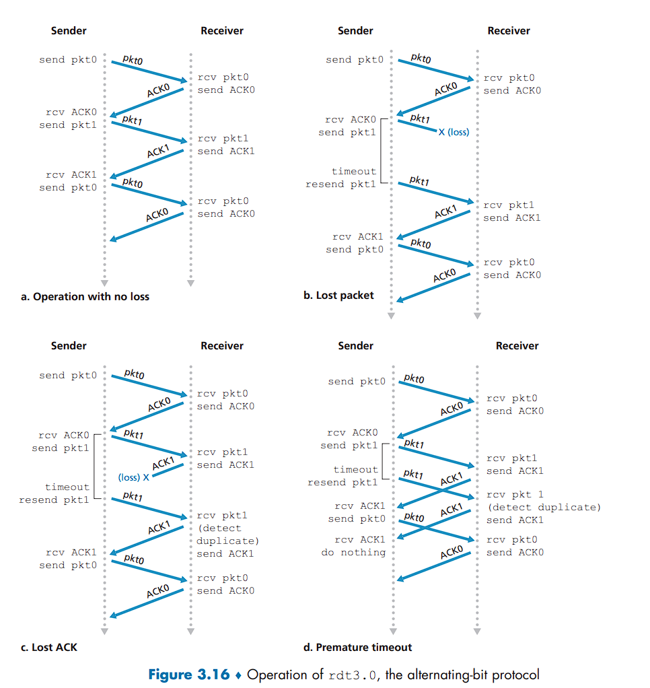

## RDT with Pipelining

The utilization of stop-and-wait is limited since it involves a small amount of acitvity. To address this issue, we can introduce *pipelining* technique into stop-and-wait protocol. There are two additional requirement should be satified:

- The range of sequence number should be increased ,as there are multiple, in-transmit and unacknowledged packets in intermediate channel. Each packet therefore must have unique sequence number.
- The sender and receiver should buffer packets to be sent and packets that have been received, respectively. Minimally, the sender must have a buffer for those packets that have been sent but not acknowledged.

There are two ways to implement a pipeline: **Go-Back-N (GBN)** and **Selective Repeat (SR)**. The distinction between them lies in whether the receiver have a buffer for those out-of-order packet.

### Go-Back-N (GBN)

The sender is allowed to transmit multiple packets without waiting for acknowledgement, but is constrained to fewer then a given maximum number, $N$, which is the size of sending window. 

We define $base$ to be the sequence number of oldest unacknowledged packet and $nextseqnum$ to be the smallest unused sequence number(that is, the sequence number of next packet to be sent), then four intervals in the range of sequence numbers can be identified. 

Sequence numbers in the interval $[0,base-1]$ correspond to packets that have already been transmitted and acknowledged. The interval $[base,nextseqnum-1]$ corresponds to packets that have been sent but not yet acknowledged. Sequence numbers in the interval $[nextseqnum,base+N-1]$ can be used for packets that can be sent immediately, should data arrive from the upper layer. Finally, sequence numbers greater than or equal to $base+N$ cannot be used until an unacknowledged packet currently in the pipeline (specifically, the packet with sequence number $base$) has been acknowledged.

The range of sequence number of transmitted but not acknowledged packets can be viewd as a window of size $N$, as the following figure shown:

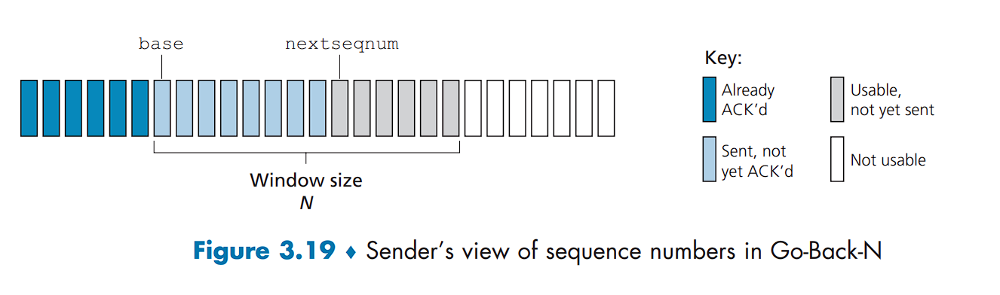

As the protocol operates, the window slides forward over the range of sequence numbers, so this protocol is usually referred to as **sliding-window protocol**.

FSM:

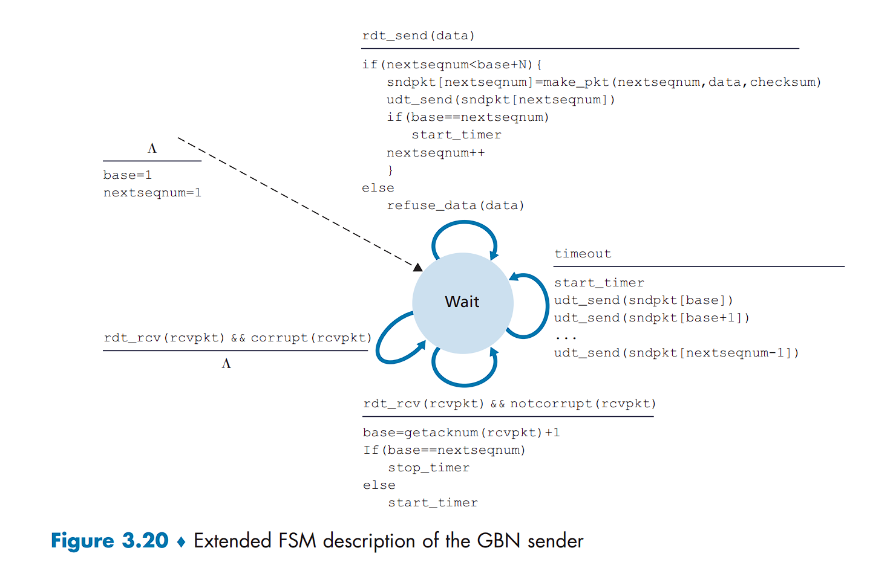

The $base$ is always set to the current sequence number in ACK. Therefore, for certain packet that is correctly received but its corresponding ACK is lost, as long as the larger sequence number in ACK arrives, the $base$ would jump to those sequence numbers that are correctly received but have lost their corresponding ACK is lost. 

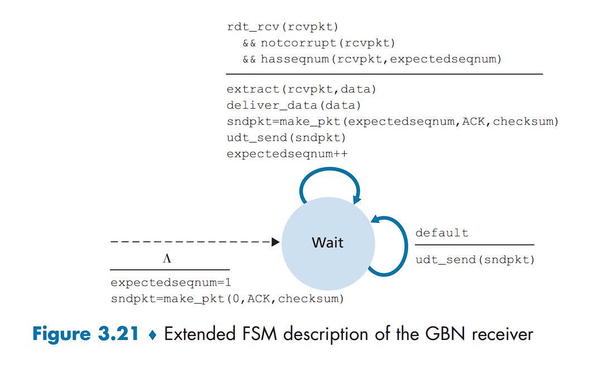

For the action taken by the initial state, `sndpkt=make_pkt(0,ACK,checksum)`, only create this packet without actually sending it.

If receiver correctly receives an out-of-order packet, it would directly discard this packet. The receiver only accepts packets with sequence number equal to $expectedseqnum$. 

