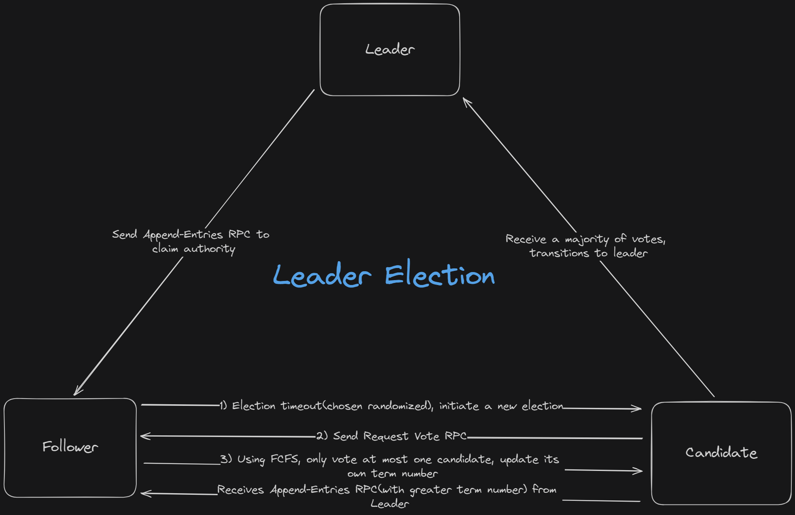
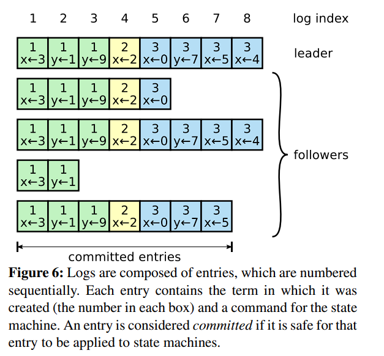
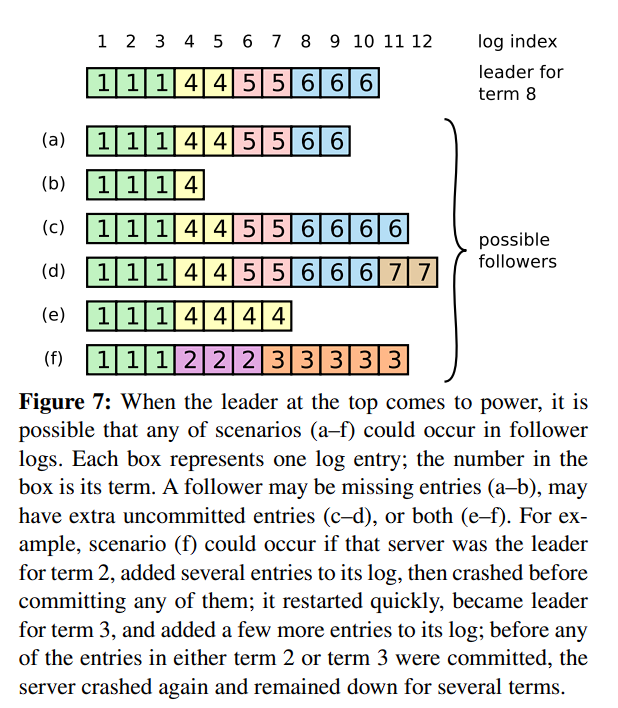
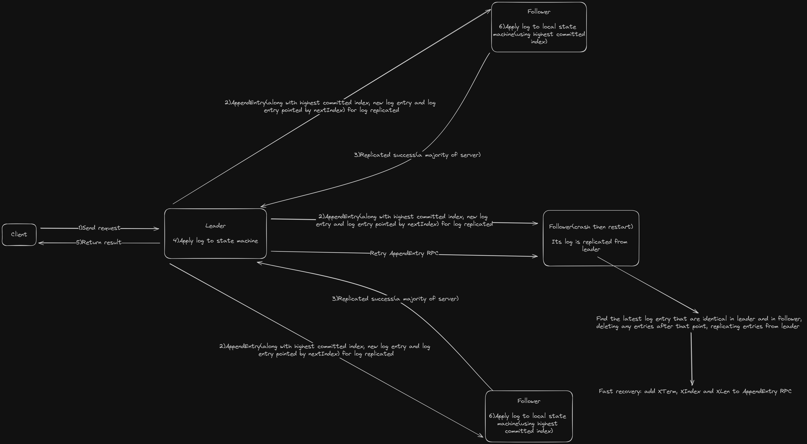
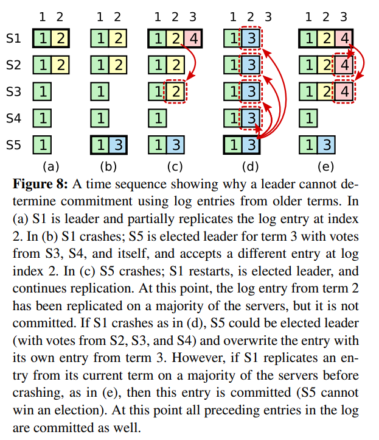
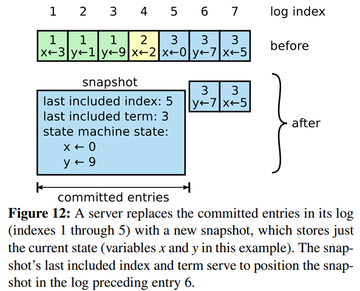
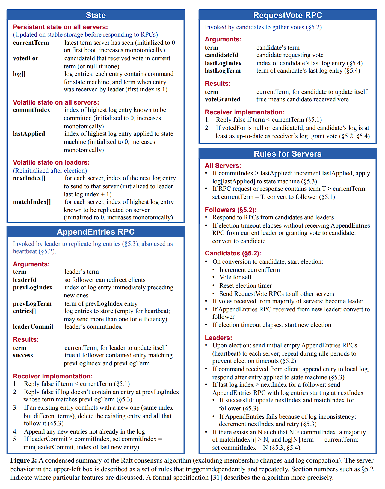
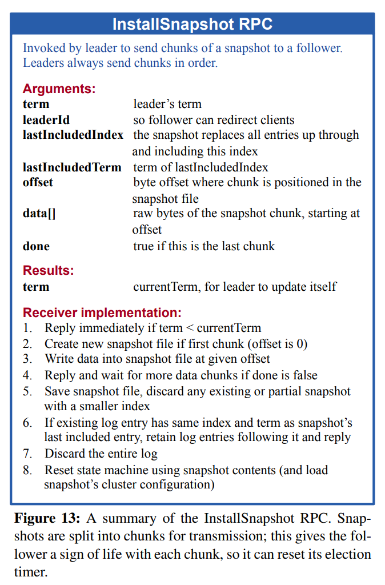

# Raft

- [Raft](#raft)
  - [Replicated state machine \& Raft Properties](#replicated-state-machine--raft-properties)
  - [Raft Basics](#raft-basics)
  - [Raft Principle](#raft-principle)
    - [Leader Election](#leader-election)
    - [Log Replication](#log-replication)
    - [Safety](#safety)
    - [Follower \& Candidate Crash](#follower--candidate-crash)
    - [Timing](#timing)
  - [Log Compaction](#log-compaction)
  - [Definition](#definition)


In this article, I will share my Interpretation of the [Raft Paper](https://raft.github.io/raft.pdf). Before delving into the details, it is beneficial to take a brief look at this [virtualization guide](http://thesecretlivesofdata.com/raft/) to gain a better understanding of the context. 

To borrow a sentense from [official web site](https://raft.github.io/), Raft is:

> Raft is a consensus algorithm that is designed to be easy to understand. It's equivalent to Paxos in fault-tolerance and performance. The difference is that it's decomposed into relatively independent subproblems, and it cleanly addresses all major pieces needed for practical systems. We hope Raft will make consensus available to a wider audience, and that this wider audience will be able to develop a variety of higher quality consensus-based systems than are available today. 

## Replicated state machine & Raft Properties

To begin, let's explore the architecture of replicated state machine, as depicted in the following figure. The server, equip with the consensus module, can be conceptualized as state machine. The replicated state machine, essentially an alias for the replicated server, is implemented using replicated log. The log comprises a sequence of commands slated for execution, and the consensus module oversees the management of this replicated log.

When a server applies a log entry to state machine, it means that the state machine executes the content of that log entry. The term "commmitted" for log entry indicates that it has been safely execute by the state machine.


Raft consistently ensure the validity of these properties at all times.

- *Election Safety*: at most one leader can be elected in a given term.
- *Leader Append-Only*: a leader never overwrites or deletes entries in its log; it only appends new entries.
- *Log Matching*: if two logs contain an entry with the same index and term, then the logs are identical in all entries up through the given index.
- *Leader Completeness*: if a log entry is committed in a given term, then that entry will be present in the logs of the leaders for all higher-numbered terms.
- *State Machine Safety*: if a server has applied a log entry at a given index to its state machine, no other server will ever apply a different log entry for the same index.

## Raft Basics

The Raft cluster comprises multiple servers. At any given of time, each server is in one of three state: *leader*, *candidate* and *follower*. Under normal execution, only one leader functions as the leader while the remaining servers act as followers. Leader handles all request from client and follower respond to request issued by leader. If clinet contacts a follower directly, the followers will redirect this request to leader. The candidate state is used to elect a new leader, and the transitions between these three states are depicted in the following figure:


The interpretation of this figure will be discussed below.

Raft divides time into *terms* in arbitrary length, with terms numbered consecutively. Each term commences with an election, during which only one server wins and becomes leader. The rest of the term involves the execution of the Raft protocol, as shown in the following figure. In some situations, election may lead to two or more leaders, called split vote. In this case, the term will end with no leader and immediately start a new election.


Terms in Raft act as a logical clock, with each server stores a *current term number* that increase monotonically over time. The current term is exchanged whenever servers communicate with each other. **If a server's current term is outdated compared to another server's current term, it updatas its current term to the larger value. Candidate and leaders, upon discovering outdated current term, revert to being follower. If server receives request with a stale current number, it rejects responding it.**

Servers in Raft communicate using RPC(remote procedure call) and there are two types of RPC in Raft: Request Vote RPC, initiated by candidates to request votes from follower during election, and AppendEntries RPC, initiated by leader to replicate log entries and provide a heartbeat mechanism.

## Raft Principle

In this section, we will delve into three subproblems—*Leader Election*, *Leg Replication* and *Safty*—decomposed by Raft in order. Notably, the safty aspect is restrition to leader election and log replication.

### Leader Election

There are two types of timeout setting in Raft: **heartbeat timeout** and **election timeout**. When server starts up, it begins as a follower. A server remains in follower state as long as it consistently receives valid RPCs(irrespective of their type) from a candidate or leader. Leader periodically sends AppendEntries RPCs, without log entries, to all follower to prevent the initiation of a new election by follower. This mechanism is called heartbeat mechanism and the interval for sending Append-Entries RPC is defined as the **heartbeat timeout**. If follower receives no communication a specified period, known as the **election timeout**, it assumes there is currently no leader and initiates a new election.

When one follower initiates a new election, it **increments its current term number and transitions to candidate state.** The candidate then **votes for itself and sends Request Vote RPCs in parallel to each of the other server** in cluster. Candidate remains this state **unless** one of three events occurs: it wins the election, another candidate wins the election or no candidate wins the election.

A candidate wins the election if it receives a majority of vote(usually greater than half) from the other server in the full cluster. Each server votes at most one candidate using a first-come-first-serve approach in a given term. When a server votes for a candidate, it update its current term to the greater of the two. we assumes that the term of candidate is greater than the term of another server; otherwise, the server will reject voting for that candidate. Once candidate wins the election, it become leader and immediately send heartbeat message(which is an AppendEntries RPC but carries no log entries.) to other server to prevent the initiation of a new election by followers.

More precisely, if there are $2F+1$ servers in Raft, a majority of server means that the number of server is greater than or equal to $F$. Additionally, this system can tolerate $F$ server crashs.

While waiting for votes, a candidate may receive an AppendEntries RPC from another 'leader' claiming its autority. The candidate then compares its own term with the term in the Append-Entries RPC. If the term in Append-Entries RPC is greater than the candidate's term, the candidate reverts to follower state; otherwise, it will reject this RPC and remain candidate state.

The thrid situation is when neither candidate wins nor loses election. If the election timeout of many followers expires simultaneously, they will transition to the candidate state and votes could be split among these candidate, preventing any candidate from receiveing a majority of votes. With no winner, all candidates revert to follower, and then they will once again experience the experiation of their election timeout simultaneously. This situation will indefinitely repeat without any additional mechanism.

Raft utilizes a randomized election timeout to address this issue. **Election timeouts are chosen randomly from a fixed interval(e.g. from 150ms to 300ms).** With no two server haveing the same election timeout, the occurrence of split vote is rare and the issue can be resolved quickly.

The structure of leader election is shown as the following figure: 



### Log Replication

Once a leader has elected, it begins receiveing requests from clients. Each request from client contains a command to be executed by replicated state machine. Raft **uses a log entry to represent a command**, and **the command is executed only when it has replicated across a majority of server in Raft**. Notably, a log contains a sequence of log entries.

The leader appends the command to its log as a new entries, then it issues AppendEntries RPCs simultaneously to all follower to replicate this log entry. When this log has safely replicated(replicated by a majority of followers), the leader executes the command and returns the result to client. **If certain followers don't respond to leader(e.g. follower crash, run slowly or network delay), the leader indefinitely issues AppendEntries RPC until this log has been safely store in all follower.**

Each log contains the command to be executed and the **term number** when this log is created by leader. Each log entry identified by **integer index**, indicating its position in the log.

The log entry, when is safely applied to state machines by leader, is termed *committed*. A log entry becomes committed once the leader successfully replicated it to a majority of servers. This act indirectly commits all preceding log entries in the leader's log, including those from previous leader's log. Raft guarantees that committed log is durable and will eventually executed by all avaliable state machines. **The leader keeps track of the highest index of the committed log entry, and it includes this index in the future AppendEntry RPC so that follower can be aware of the latest committed log entry. When follower learns that a certain log entry is committed by leader, it commits that log entry in its local state machine.**

The committed log entries are depicted in the following figure:



At the presence of log index 8, the preceding 7 log entries haven been all committed. **The log entry at index 8 is considered committed only when it has been successfully replicated on a majority of servers, and new index 9 has been created.**

Raft consistently gurantees the validation of the following properties: 

- If two entries in different logs have the same index and term, then they store the same command.
- If two entries in different logs have the same index and term, then the logs are identical in all preceding entries.

The first property follows from the fact that leader only appends once in specified index in the log in a given term and second property is guaranteed by the consistency check in AppendEntry RPC. When sending AppendEntry RPC, leader includes the index and term of the latest log entry along with the index and term of the immediately previous one. **If the follower doesn't find the entry satisfying the latter, it refuses the current appended log entry.**

To borrow the expression from the original paper, this process is:

> The consistency check acts as an induction step: the initial empty state of the logs satisfies the Log Matching Property, and the consistency check preserves the Log Matching Property whenever logs are extended.  As a result, whenever AppendEntries returns successfully, the leader knows that the follower’s log is identical to its own log up through the new entries.

During normal execution, the log in leader and followers is consistent and does not result in faults. However, when the leader crashs, the inconsistencies between the leader and followers may occur. A follower may lose log entries that are present in leader, or it may have extra entries that are no present in leader, as shown in the following figure:



In Raft, leader handles inconsistencies by forcing the follower's log to be the same as the leader's log. This means that each conflicting log entry in followers will be overwritten with the leader's log entries.

To ensure that the follower's log is the same as the leader's log, leader must find **the latest log entry where they are identical.** At that point, follower will delete subsequent log entries and insert leader's log entries. All of this action is occured within the consistency check in the AppendEntry RPC.

Leader maintains a *nextIndex* for each follower, represtenting the position of the next log entry in leader's log to be sent to that follower. When the leader first comes to power, it initializes all nextIndex values to the latest index in its own log(in the former example, it is 11). If the follower's log is inconsistent with the leader's, the consistency check in AppendEntry RPC will fail in that index. The leader then decreases the nextIndex and retries the AppendEntry RPC. Eventually, nextIndex will reach the index correspending to the log entry in the follower and in the leader is identical. When this happens, AppendEntry RPC will succeed and remove any conflicting log entries in the follower. With all these steps done, the follower can append the leader's log entries from that index as normal execution.

In the above discussion, we learned that the AppendEntry RPC always send two pairs of (index, term) along with the correspenging log entry to the follower. One represents the new log entry, and the other represents the immediately previous one. After introducing consistency-handling mechanism, I think that the content of the AppendEntry RPC will include two log entries, one is the new log entry, the other is the log entry pointed by nextIndex.

For fast recovery from inconsistency, the description in the paper is as follows:

> If desired, the protocol can be optimized to reduce the number of rejected AppendEntries RPCs. For example, when rejecting an AppendEntries request, the follower can include the term of the conflicting entry and the first index it stores for that term. With this information, the leader can decrement nextIndex to bypass all of the conflicting entries in that term; one AppendEntries RPC will be required for each term with conflicting entries, rather than one RPC per entry. In practice, we doubt this optimization is necessary, since failures happen infrequently and it is unlikely that there will be many inconsistent entries.

The core idea in this optimization is to treat a term as a unit instead of a log entry as a unit, notably, allowing the terms of multiply log entries to be identical.

The current state of all nodes is as follows, and the numbers in each row represtent **the term of that log entry**.

```
     Case 1      Case 2       Case 3
idx: 1 2 3 4     1 2 3 4      1 2 3 4
S1:  4 5 5       4 4 4        4
S2:  4 6 6 6 or  4 6 6 6  or  4 6 6 6

S2 is leader for term 6, S1 comes back to life, S2 sends AE for last 6 AE has prevLogTerm = 6 and nextIndex = 3

nextIndex is the index of prevLogTerm
```

For implementing fast recovery(roll back), we should add three fields to AppendEntries RPC: `XTerm`, which represents the **term** in the conflicting entry(if any) in the follower, `XIndex`, which represents the first index of that term(if any) in the follower, and `XLen`, which represents the length of log in the follower.

```
case 1: 
XTerm: 5, XIndex: 2, XLen: 3
leader don't have XTerm, nextIndex = XIndex
----------
case 2:
XTerm: 4, XIndex: 1, XLen: 3
leader have XTerm, nextIndex = leader's last entry for XTerm(it's 1)
---------
case 3:
XTerm: 4, XIndex: 1, XLen: 1
there are no log entry in nextIndex, nextIndex = XLen
```

The structure of log replication is shown as the following figure: 



### Safety

So far, we have discussed the sections on leader election and log replication; however, these mechanisms are not quite sufficient to ensure the correctness of Raft algorithm. For example, a follower might be unavailable when leader commits serveral log entries, and after it restart, it may be elected as a leader and force original leader to replicate its own log. In this situation, the state machine of the original leader has executed commands that are not present in new leader. As a result, different state machine may execute different command(because the committed log entries may be ignored).

In the safety section, we will add restrictions to leader election to ensure that **the leader for any given term contains all committed log entries in previous terms.**

**Raft ensures the presence of all committed log entries from previous terms on each new leader.** Raft algorithm avoids adding extra mechanisms to transmit log entries from the original leader to the new leader, ensuring that the log only flows in a unidirectional manner, from leader to follower, and leader never overwirtes its log entries.  

The first sub-restriction is that **the candidate wins election only when its log includes all committed entries.** In secure victory in the election, the candidate must contact a majority of servers in cluster,*ensuring that it possesses the committed log entries for each server. **If the candidate's log is at least as up-to-date as any other server in majority, it ensures that all committed log entries are presentd in the candidate.**

The comparesion of latest log in Raft involves comparing the **index** and **term** of the last log entries in log. it's essential to note the distinction between 'log' and 'log entry'; the former includes a sequence of the latter. **If the last log entries in two logs are different in term, then the log with the later term is considered more up-to-date. If the last log entries in two log are identical in term, then the log with the greater index is considered more up-to-date(its length is more longer).**

The RequestVote RPC implements this restriction by including the information about candidate's log. **If a voter discovers that its own log is more up-to-date than candidate's log, it will reject the vote.**

The second sub-restriction arises from the issue that if the original leader crashs and a new leader is elected, the new leader may be unable to determine whether log entries replicated in a majority of servers are committed. For instance, if certain log entries have been replicated in a majority of servers but the original leader crashs before committing them, the new leader can not determine whether its current log entries have been committed. 

This issue is shown as the following figure:



By the way, each RPC, irrespective of type, updates the current term in server. The comparsion in the first sub-restriction utilizes the term and index of the latest log entry instead of the current term.

Phases (d) and (e) are derived from phase (c) but the latter is right(former is wrong). The log entry with term 2 and index 2 has been successfully replicated on a majority of servers. If S1 crashs and S5 is elected as a leader, whether the log entry with term 2 and index 2 commits or nor, it will be overwritten by the log entry with term 3 and index 2. The issue arises Here: the log entry, replicated on a majority of servers, is overwritten by another leader.

Therefore, **Raft commits previous log entries that have been replicated on a majority on servers but remain uncommitted, only when the log entry with the current term has been replicated across a majority of servers.**

The original expression of this section in paper is written as follows. However, I find this expression is difficult to understand, so I provide my own interpretation.

> To eliminate problems like the one in Figure 8, Raft never commits log entries from previous terms by counting replicas. Only log entries from the leader’s current term are committed by counting replicas; once an entry from the current term has been committed in this way, then all prior entries are committed indirectly because of the Log Matching Property.

So far, let's conclude the section of safety, the restriction is:

- the leader for any given term contains all committed log entries in previous terms. 
  - the candidate wins election only when its log includes all committed entries. 
  - Raft commits previous log entries only when log entries with current term have been replicated on a majority of servers.

### Follower & Candidate Crash 

In this section, I provide the original expression from the paper because they are easy to understand.

> Until this point we have focused on leader failures. Follower and candidate crashes are much simpler to handle than leader crashes, and they are both handled in the same way. If a follower or candidate crashes, then future RequestVote and AppendEntries RPCs sent to it will fail. Raft handles these failures by retrying indefinitely; if the crashed server restarts, then the RPC will complete successfully. If a server crashes after completing an RPC but before responding, then it will receive the same RPC again after it restarts. Raft RPCs are idempotent, so this causes no harm. For example, if a follower receives an AppendEntries request that includes log entries already present in its log, it ignores those entries in the new request.

### Timing 

Raft system must satify the following timing requirement:

$$
broadcastTime\ll electionTimeout\ll MTBF
$$

In this inequality, $broadcastTime$ represents the average round time of RPCs, $electionTimeout$ is the user-specified election timeout, and $MTBF$ is the average time between failures for a single server.

> The broadcast time should be an order of magnitude less than the election timeout so that leaders can reliably send the heartbeat messages required to keep followers from starting elections; given the randomized approach used for election timeouts, this inequality also makes split votes unlikely. The election timeout should be a few orders of magnitude less than MTBF so that the system makes steady progress. When the leader crashes, the system will be unavailable for roughly the election timeout; we would like this to represent only a small fraction of overall time.
>
> Raft’s RPCs typically require the recipient to persist information to stable storage, so the broadcast time may range from 0.5ms to 20ms, depending on storage technology. As a result, the election timeout is likely to be somewhere between 10ms and 500ms. Typical server MTBFs are several months or more, which easily satisfies the timing requirement.

## Log Compaction

Raft's log grows unbounded during normal execution. Therefore, we need an approach to compress log. Raft utilizes *snapshot* to compress the log. It writes the snapshot to stable storage, and then entire log up to that point is discarded.

The principle of the snapshot is discribed in the following figure:



Each server independently takes **snapshot that includes all committed log.** The snapshot includes additional metadata required for consistency check, such as *last included index*, representing the index of the last log entry in snapshot, and *last included term*, representing the term of the last log entry in snapshot. This metadata is essential for each consistency check in AppendEntry RPC, as it requires the previous index and term. **After a server completes snapshot in its own log, it discards all committed log entries that have been compressed in the current snapshot and any prior snapshots.**

In specific situation, such as when a follower's log significantly lag behind the leader's or when a new server joins in closter, the leader requires a method to send its own snapshot to those followers that are too far behind over the network. This action is facilitated using another RPC: InstallSnapshot RPC.

The leader initiates the InstallSnapshot RPC to dispatch its own snapshot to followers that lag significantly behind. Since the snapshot typically includes information absent in the follower's log, conflicts are inevitable. In such instances, the follower discards all its existing log entries and is supersuded by the receving snapshot. If the follower receives a snapshot that discribes a prefix of log entries alreadly present in its log, only its own log entries that are compressed within the received snapshot are deleted, while the remaining log entries will be retain.

The paper discusses two issues that impact performance, here I provide the original expression:

> There are two more issues that impact snapshotting performance. First, servers must decide when to snapshot. If a server snapshots too often, it wastes disk bandwidth and energy; if it snapshots too infrequently, it risks exhausting its storage capacity, and it increases the time required to replay the log during restarts. **One simple strategy is to take a snapshot when the log reaches a fixed size in bytes.** If this size is set to be significantly larger than the expected size of a snapshot, then the disk bandwidth overhead for snapshotting will be small.
>
> The second performance issue is that writing a snapshot can take a significant amount of time, and we do not want this to delay normal operations. The solution is to use copy-on-write techniques so that new updates can be accepted without impacting the snapshot being written. For example, state machines built with functional data structures naturally support this. Alternatively, the operating system’s copy-on-write support (e.g., fork on Linux) can be used to create an in-memory snapshot of the entire state machine (our implementation uses this approach).

## Definition

At the end, I list the definition of Raft from the paper.






