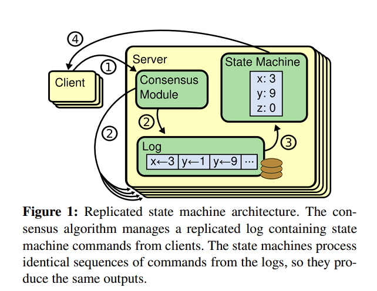
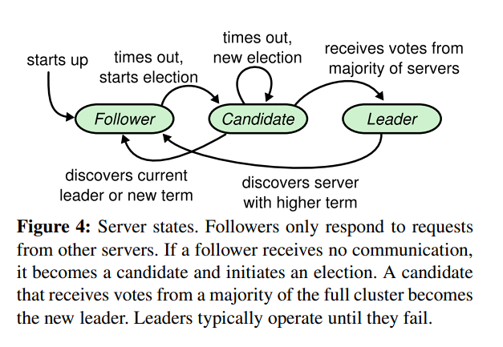
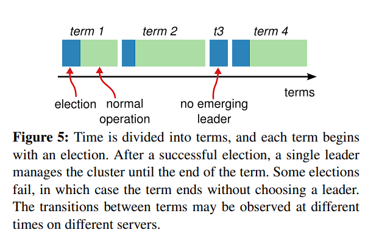

# Raft

- [Raft](#raft)
  - [Replicated state machine \& Raft Properties](#replicated-state-machine--raft-properties)
  - [Raft Basics](#raft-basics)

In this article, I will share my Interpretation of the [Raft Paper](https://raft.github.io/raft.pdf). Before delving into the details, it is beneficial to take a brief look at this [virtualization guide](http://thesecretlivesofdata.com/raft/) to gain a better understanding of the context. 

To borrow a sentense from [official web site](https://raft.github.io/), Raft is:

> Raft is a consensus algorithm that is designed to be easy to understand. It's equivalent to Paxos in fault-tolerance and performance. The difference is that it's decomposed into relatively independent subproblems, and it cleanly addresses all major pieces needed for practical systems. We hope Raft will make consensus available to a wider audience, and that this wider audience will be able to develop a variety of higher quality consensus-based systems than are available today. 

## Replicated state machine & Raft Properties

To begin, let's explore the architecture of replicated state machine, as depicted in the following figure. The server, equip with the consensus module, can be conceptualized as state machine. The replicated state machine, essentially an alias for the replicated server, is implemented using replicated log. The log comprises a sequence of commands slated for execution, and the consensus module oversees the management of this replicated log.

When a server applies a log entry to state machine, it means that the state machine executes the content of that log entry. The term "commmitted" for log entry indicates that it has been safely execute by the state machine.

Raft consistently ensure the validity of these properties at all times.

- *Election Safety*: at most one leader can be elected in a given term.
- *Leader Append-Only*: a leader never overwrites or deletes entries in its log; it only appends new entries.
- *Log Matching*: if two logs contain an entry with the same index and term, then the logs are identical in all entries up through the given index.
- *Leader Completeness*: if a log entry is committed in a given term, then that entry will be present in the logs of the leaders for all higher-numbered terms.
- *State Machine Safety*: if a server has applied a log entry at a given index to its state machine, no other server will ever apply a different log entry for the same index.

## Raft Basics

The Raft cluster comprises multiple servers. At any given of time, each server is in one of three state: *leader*, *candidate* and *follower*. Under normal execution, only one leader functions as the leader while the remaining servers act as followers. Leader handles all request from client and follower respond to request issued by leader. If clinet contacts a follower directly, the followers will redirect this request to leader. The candidate state is used to elect a new leader, and the transitions between these three states are depicted in the following figure:

The interpretation of this figure will be discussed below.

Raft divides time into *terms* in arbitrary length, with terms numbered consecutively. Each term commences with an election, during which only one server wins and becomes leader. The rest of the term involves the execution of the Raft protocol, as shown in the following figure. In some situations, election may lead to two or more leaders, called split vote. In this case, the term will end with no leader and immediately start a new election.

