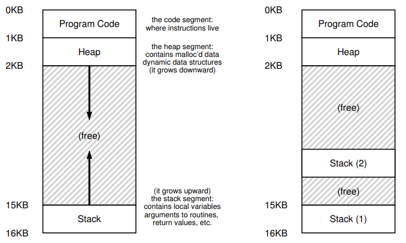

# Concurrency

- [Concurrency](#concurrency)
  - [Overview](#overview)
  - [Thread API](#thread-api)


## Overview

我们可以将进程进一步划分，便可以得到「线程」。一个单线程程序只有一个执行点（一个程序计数器，用来取指和执行），而多线程 `multi threaded` 程序具有多个执行点（多个程序计数器，每个都用来取指和执行）。实际上每个线程都有点像是独立的进程，但与进程不同的是，它们**共享相同的地址空间**

线程的状态与进程的状态类似，每个线程都有一个程序计数器和一组用于计算的寄存器。当需要进行上下文切换转去运行其他线程时，进程间的转换需要将进程的状态信息保存在进程控制块 `Process Control Block, PCB` 中，并**切换地址空间**；线程同样需要将当前线程的状态保存在线程控制块 `Thread Control Block, TCB` 中，但**不需要切换地址空间**

在传统的单线程地址空间模型中，只有一个栈，位于地址空间底部，程序代码位于地址空间最上面。而对应多线程程序而言，**不是地址空间只有一个栈，而是每个线程都有一个栈**，如下图：



我们需要明确这两个定义：

* 临界区 `critical section`：一段访问**共享**资源（变量或数据结构）的代码，必须要保证所有的线程在此处是互斥 `mutual exclusion` 访问
* 竞态条件 `race condition`：出现多个线程同时进入临界区导致一些不希望出现的结果

我们用一个简单的例子来描述临界区和竞态条件这两个概念，考虑如下代码：

```cpp
int cnt = 0;

void* addone(void* arg)
{
    for(int i = 0; i < 1e5; i ++)
        cnt++;
    return NULL;
}

int main()
{
    pthread_t t1, t2;
    cout << "begin: " << cnt << endl;
    pthread_create(&t1, NULL, addone, NULL);
    pthread_create(&t2, NULL, addone, NULL);
    pthread_join(t1, NULL);
    pthread_join(t2, NULL);
    cout << "end: " << cnt << endl;
    return 0;
}
```

`cnt` 为全局的**共享**变量，也就是每个线程都可以访问，访问该变量的代码我们称之为 `临界区`。我们创建了两个线程，每个线程都会对 `cnt` 加一，总共应该会加 `2e5` 次

执行的结果如下：

```bash
begin: 0
end: 139023
```

我们发现这个结果并不是 `2e5`，是一个其他的数。其实这里如果我们多执行几次，会发现每次的结果都不相同。由于每次的执行结果都不确定，这便是 `竞态条件`

我们假设 `cnt++` 被翻译为以下代码：

```assembly
mov 0x8049a1c, %eax
add $0x1, %eax
mov %eax, 0x8049a1c
```

我们从地址 `0x8049a1c` 处读取值到寄存器中，对寄存器中的数组加一，然后将该值加载回去

假设初始值为 `50`，假设线程 `1` 执行将值加载到寄存器中并对其加一，次数寄存器中的值为 `51`。如果这个时候触发时钟中断，操作系统将当前线程的状态保存在 `TCB` 中，并切换为线程 `2` 运行。如果线程 `2` 能够全部执行完所有的代码，那么这个时候会将 `51` 写入到该地址处（也就是 `cnt` 变为 `51`）。此时中断再次发生，转为线程 `1` 运行，线程 `1` 会**将 `51` 再次写入到该地址处**，这里便是问题所在了

本应该两个线程独立使 `cnt` 加一，最终的结果应该变为 `52`，但实际上我们的结果只是 `51`。由于不合时宜的时钟中断，导致某个线程执行了重复的操作，这便是每次执行结果不一样的原因

因此，我们才要求线程互斥 `mutual exclusion` 地访问临界区

## Thread API

