# Persistence

- [Persistence](#persistence)
  - [Introduce](#introduce)
  - [Device Interface \& Disk](#device-interface--disk)
    - [System Architecture](#system-architecture)
    - [Canonical Device](#canonical-device)
  - [Redundant Array of Inexpensive Disk](#redundant-array-of-inexpensive-disk)
    - [RAID Level 0: Striping](#raid-level-0-striping)
    - [RAID Level 1: Mirroring](#raid-level-1-mirroring)
    - [RAID Level 4: Saving Space With Parity](#raid-level-4-saving-space-with-parity)
    - [RAID Level 5: Rotating Parity](#raid-level-5-rotating-parity)
  - [File \& Directory](#file--directory)
    - [System Call](#system-call)
      - [open \& write](#open--write)
      - [lseek](#lseek)
      - [fsync](#fsync)
      - [rename](#rename)
      - [stat \& fstat](#stat--fstat)
      - [link \& unlink](#link--unlink)
      - [mount](#mount)
  - [File System Implementation](#file-system-implementation)
    - [Overall Organization](#overall-organization)
    - [Inode Structure](#inode-structure)
    - [Access Path](#access-path)
      - [Read File](#read-file)
      - [Write File](#write-file)
    - [Cache \& Buffer](#cache--buffer)

## Introduce

为了让数据能够更为持久的保存，需要硬件（磁盘 `disk`）和软件（文件系统 `file system`）之间的合作完成，在此我们简单的讨论一下操作系统如何与设备进行通信，我们关注的重点在于文件系统这部分

## Device Interface & Disk

### System Architecture

一个标准的系统架构如下图所示

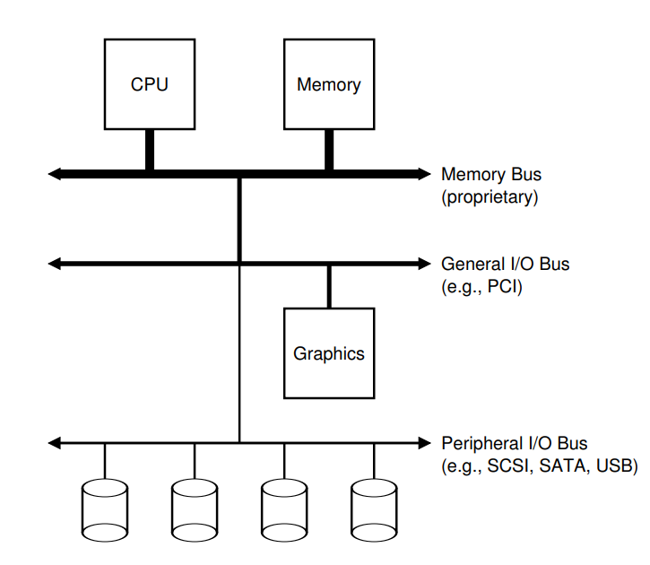

图中越粗的线表示的速度越快，`CPU` 通过内存总线 `Memory Bus` 与系统内存相连；图像处理（显卡 `Graphics`）或者高性能设备通过通用 `I/O` 总线 `General I/O Bus` 与系统相连；**磁盘**、鼠标通过最外围的外围总线 `Peripheral I/O Bus` 连接到系统。也就是说，硬盘与系统的交换实际上是很慢的

### Canonical Device

一个标准设备 `Canonical Device` 的接口与内部如下所示：

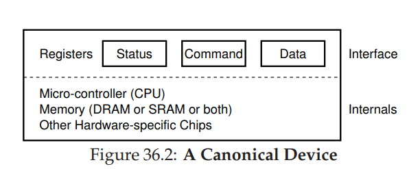

外部接口 `interface` 由三个寄存器组成：状态 `status`、命令 `command`和数据 `data`；内部组成 `internals` 由硬件构成：微处理器、内存和其他硬件芯片

操作系统与设备的交换主要通过设备提供的接口实现。`status` 寄存器可以读取并查看当前设备的状态；`command` 寄存器可以通知设备执行某个具体的命令；`data` 寄存器可以将数据传送给设备或从设备中读取数据

一个标准的与设备通信的协议分为以下四部：

1. 操作系统反复读取 `status` 寄存器，等待设备进入可以接收指令的状态，这称为轮询 `polling`
2. 操作系统将**数据**下发到 `data` 寄存器，这个过程中如果 `CPU` 参与数据移动我们称这个过程为 `Programming I/O`
3. 操作系统将命令写入 `command` 寄存器
4. 操作系统反复轮询该设备，判断命令是否执行完毕

当然，这个过程中有很多部分是可以优化的，例如操作系统可以使用中断来避免反复轮询，通过使用 `DMA, Direct Memory Access` 来避免 `Programming I/O`，可以进一步释放 `CPU` 的时间

由于每个设备的接口都不一样，为了将不同的设备纳入操作系统，操作系统需要有这些设备的设备驱动程序 `Device Driver`，通过这一层抽象，操作系统便可以对设备进行操作了（`Linux` 系统中有 `70%` 的代码都是各种驱动程序）

## Redundant Array of Inexpensive Disk

> 我们不讨论磁盘如何设计，我们只关注如何利用磁盘构建一个大型、快速、可靠的存储系统

廉价冗余磁盘阵列（`Redundant Array of Inexpensive Disk`）是将多个磁盘构建成一个更快、更大、更可靠的文件系统。从外部看，`RAID` 是一个磁盘，包含一系列可用读取和写入的块；从内部看，`RAID` 由多个磁盘、内存和一个或多个处理器构成

从性能 `Performance` 上来说，并行地使用多个磁盘可用加快 `I/O` 速度；从容量 `Capacity` 上来说，使用多个磁盘可以显著地提高容量；从可靠性 `Reliability` 上来说，允许一定程度的冗余能够保证系统在部分磁盘损坏的情况下还能正常工作。这三个方面也是评估 `RAID` 的三个指标

`RAID` 的设计有三种：`RAID Level 0 (Striping), RAID Level 1 (Mirroring), RAID Level 4/5 (Parity-Based Redundancy)` 

### RAID Level 0: Striping

这个级别的 `RAID` 没有冗余，它按照条带化 `Striping` 的方式将磁盘阵列中的块组织在磁盘上。我们将同一行中的块 `block` 称为条带，如下图（这里我们假定有四个磁盘 `disk`，每个 `block` 的大小为 `4KB`）：

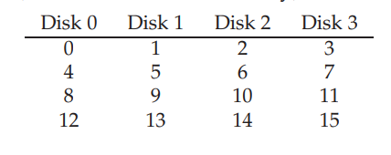

在这里，每一条 `stripe` 包含四个 `block`，大小为 `16KB`，**一共有四条 `stripe`**。当然，我们也可以将相邻的两个 `block` 放在同一个磁盘上以此构成一个 `chunk`，那么每个 `chunk` 的大小为 `8KB`，每一条 `stripe` 包含四个 `chunk`，大小为 `32KB`，**一共有两条 `stripe`**，如下图：

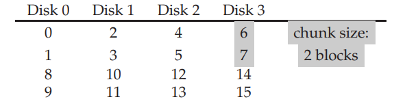

在这里，如果 `chunk size` 过小，也就意味着许多文件可用跨越多个磁盘，这增加了文件并行读取的效率，但会增加跨多个磁盘访问的定位时间；相应地，如果 `chunk size` 过大，则会减小这种并行性，但定位时间则会降低

在评价性能时，我们主要考虑两种工作负载 `workload`：顺序 `sequential` 和随机 `random`。对于前者，我们假定对阵列的请求大部分是连续的；对于后者，我们假定每次请求都很小，并且随机分布在磁盘上的不同位置。我们设 `sequential` 下以 $S\ \rm MB/s$ 传输数据，`random` 下以 $R\ \rm MB/s$ 传输数据

> 我们简单计算一下二者的差距，假设我们的磁盘的属性如下：
> 
> * 平均寻道时间 $7\ \rm ms$
> * 平均旋转延迟 $3\ \rm ms$
> * 磁盘传输速率 $50\ \rm MB/s$
> 
> 我们设 $10\ \rm MB$ 为连续传输，$10\ \rm KB$ 为随机传送，那么有：
> 
> $$
> \begin{align*}
> &S=\frac{10\rm MB}{(7 + 3 + 200)\rm ms} = 47.62\ \rm MB/s\\
> &R=\frac{10\rm KB}{(10+\frac{10\rm KB}{50\rm MB/s})\rm ms}=0.981\ \rm MB/s
> \end{align*}
> $$
>
> 二者相差了 $50$ 倍

从性能的角度来看，单个块的请求延迟与磁盘延迟相一致；从容量的角度来看，我们并没有冗余，因此 $N$ 个磁盘全部用于存储数据；从可靠性的角度来看，顺序**吞吐量**为：$N\times S$，随机**吞吐量**为：$N\times R$

> 需要说明的是，吞吐量等价于后面所说的带宽

### RAID Level 1: Mirroring

`RAID 1` 仅仅是在 `RAID 0` 的基础上添加冗余，如下图：

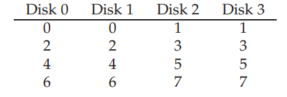

对于镜像 `mirror` 阵列，读取时可以读取任意一个副本。但在写入时，则需要更新两个副本的数据，以保持数据的可靠性。由于冗余分布在不同的磁盘上，因此这些写入可以**并行**进行

> 我们可以同时对多个磁盘进行并行读写，但对于单个磁盘的读写只能按顺序执行。因此我们选择**将冗余分布在多个磁盘而不是单个磁盘上**

从容量的角度来看，在有 $N$ 个磁盘的前提下，可以用作存储的空间为 $N/2$；从可靠性的角度来看，`Merror Level = 2`的 `RAID` 最多允许 $N/2$ 个磁盘发生损坏（运气爆炸的情况下）；最后我们分析性能，这其实稍微有点复杂

对于**顺序写入**，由于我们可用的磁盘实际上只有 $N/2$ 个，因此**顺序写入**的峰值带宽为 $\frac{N}{2}\times S$（也就是我们只能使用 $N/2$ 个磁盘进行顺序读取）

而对于**顺序读取**，直观上来看，我们可用从两个磁盘中任意读取一个，貌似会比写入的性能更好，但不幸的是，**顺序读取的峰值带宽**依旧为 $\frac{N}{2}\times S$，我们具体分析一下这个问题：

由于对每个 `block` 的读取可以来自两个磁盘，因此如果读取 `block 0, 1, 2, 3, 4, 5, 6, 7`，我们假定它们分布被定位到 `disk 0, 2, 1, 3, 0, 2, 1, 3`。发现问题了吗，**对于同一个磁盘而言，两次读取的块并不是连续的**，因此在这种情况下每个磁盘只能提供其峰值带宽的一半，因此顺序读取的峰值带宽依旧为 $\frac{N}{2}\times S$

对于**随机读取**，我们可以使用全部 $N$ 个磁盘进行随机读取，因此其峰值带宽为 $N\times S$

对于**随机写入**，由于只能使用 $N/2$ 个磁盘，因此其峰值带宽为 $\frac{N}{2}\times S$

### RAID Level 4: Saving Space With Parity

我们可以通过向磁盘阵列中添加奇偶校验 `parity` 来提供数据恢复，但这种方式的代价是性能

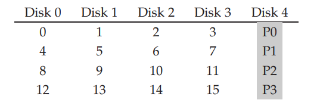

`disk 4` 用于提供奇偶校验块，这个块的加入使得在同一条带下允许某个块出现损坏

我们考虑用异或 `XOR` 来实现奇偶校验。对于一组 `bits` 而言，如果其中有偶数个 `1`，那么异或的值为零；如果有奇数个 `1`，那么异或的值为一，即：


在第一行中，由于存在两个 `1`，因此结果为 `0`；第二行中由于存在一个 `1`，因此结果为 `1`。加入了奇偶校验后，我们可以允许任意一个 `block` 发生损坏，假设 `C2` 列发生损坏（也就是两个 `block`），我们可以**依据奇偶校验的结果重构 `reconstruct` 出 `C2` 列原先的值**，这便实现了数据的可靠性

需要说明的是，我们只能允许一列发生故障，如果多于一列，那么数据将无法重建

当我们将 `XOR` 用于块，我们只需要对每一个条带中的 `block` 各个位依次异或，将得到的结果存放在奇偶校验 `disk` 中即可：

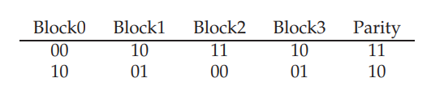

现在我们来分析 `RAID 4`。从容量的角度来看，由于使用了一个磁盘作为奇偶校验盘，因此实际存储数据的只有 $N-1$ 个磁盘，也就是容量为 $N-1$；从可靠性的角度来看，**至多允许一个磁盘发生故障**，而如果过多的磁盘发生故障，那么无法重建原先的值

对于**顺序读取**，我们会用到除奇偶校验之外的所以磁盘，因此顺序读取的峰值带宽为 $(N-1)\times S$

对于**顺序写入**，在将大块数据写入磁盘时，`RAID 4` 可以做一种简单的优化，被称为全条带写入 `full-stripe wirte`。在下图中，假设需要对 `block 0, 1, 2, 3` 进行写入，那么 `RAID` 会对这些**新块**计算 `P0` 的新值，然后将**五个**磁盘并行地写入

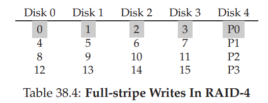

因此，在 `RAID 4` 上顺序写入的性能就很容易分析了，我们至多只能使用 $N-1$ 个磁盘，因此峰值带宽为 $(N-1)\times S$

对于**随机读取**，某个 `block` 可以随机地分布在 $N-1$ 个磁盘上，因此峰值带宽为 $(N-1)\times R$

对于**随机写入**，情况则相对复杂一点。在上图中，我们假设对 `block 1` 进行写入，我们可以直接用新值覆盖旧值，但我们需要更新 `P0` 的值，这里有两种方法：

第一种方法是加法奇偶校验 `additive parity`：为了计算新的奇偶校验块的值，我们需要读取其他所有 `block` 的值（在这里，我们需要读取 `block 0, 2, 3` 的值），然后将 `P0` 的新值写入。这种方法有一个明显的问题是，如果同一 `stripe` 的 `block` 数量过多，就会导致很大的读取流量，因此还有一种的方法

第二章方法是减法奇偶校验 `subtractive parity`：我们考虑一个简单的例子，想象有四个数据位和一个奇偶校验位：

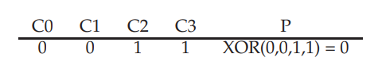

我们希望用一个新值来覆盖 $C2$，设为 $C2_{new}$。我们首先读入 $C2$（也就是 $C2_{old}=1$）和 $P_{old}=0$

我们需要比较新数据和旧数据，如果二者相同，那么奇偶校验位不变，即 $P_{new}=P_{old}$；如果二者不同，那么我们需要**将奇偶校验位翻转**。也就是说，如果 $P_{old}=0$，那么 $P_{new}=1$，反之同理。我们可以用以下式子表示这个过程：

$$
P_{new}=(C_{old}\oplus C_{new})\oplus P_{old}
$$

由于我们处理的对象是 `block`，但我们依旧可以沿用这种做法，只需要将 `block` 中的每一位按照上述操作执行即可

还是刚刚的例子，如果我们使用 `additive parity`，那么我们需要执行六次物理 `I/O`（四次用于读取四个数据位，剩下两次分别用于对新块和奇偶块的写入），如果我们使用 `substractive parity`，那么我们只需要四次物理 `I/O`（两次读取数据块和奇偶块的旧值，两次写入数据块和奇偶块）

这里我们考虑并行执行写入时 `RAID 4` 的效率，我们分别写入 `block 4, 13`，那么我们需要对 `P1` 和 `P3` 进行修改，如下图：

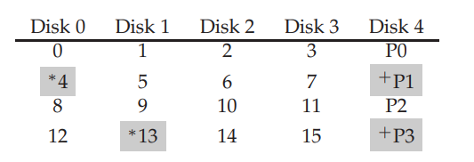

这里的问题是，我们确实可以并行读取和写入 `block 4` 和 `block 13`，但对于奇偶块的更新，`P1` 和 `P3` 的读取和写入只能**顺序执行**。因为我们只能对不同的磁盘并行进行读写，但对于同一个磁盘只能顺序读写，而 `P1` 和 `P3` 恰好在同一个磁盘上

对于每一次逻辑 `I/O`，奇偶校验磁盘都会对应执行两次 `I/O`（一次读取，一次写入），因此对于**随机写入**，**峰值带宽**仅仅为 $R/2$（这种问题被称为小写入问题）

> 随机写入的速度为 $R$，而由于奇偶块的瓶颈，每次对奇偶块的写入都会转化为顺序两次操作，因此速度退化为 $R/2$
>
> 这种情况下，**因为无论我们加多少磁盘，都无法改变其带宽**

我们最后分析以下 `RAID 4` 中的 `I/O` 延迟，对于单次读取，其延迟等同于单个磁盘的请求延迟；而对于单次写入，则需要两次读取（读取同一 `stripe` 中的数据块和奇偶块）和两次写入（写入同一 `stripe` 中的数据块和奇偶块），由于读取可以并行执行，写入也可以并行执行，因此总体上等于两倍磁盘的延迟

### RAID Level 5: Rotating Parity

我们将奇偶块的分布改为跨磁盘旋转，如下：

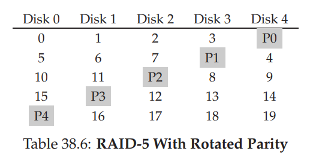

由于 `RAID 5` 的设计与 `RAID 4` 的设计几乎一致，加入旋转是为了解决小写入问题，因此在随机写入的性能上，总带宽将变为 $\frac{N}{4}\times R$，这里 `4` 倍的损失是因为每次写入依旧会造成额外的 `4` 个 `I/O` 操作

最后是一个总结性的表格，如下：

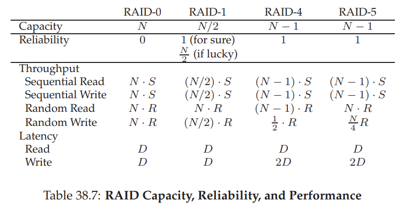

---

## File & Directory

存储虚拟化提供的两个重要的抽象分别为：文件 `file` 和目录 `directory`

* `file`：文件是一个线性的字节数组，每个字节可用写入或读取。每个文件都有一个低级名称 `low-level name`，通常为某种数字（用户并不知道）。由于历史原因，文件的低级名称通常也被称为 `inode` 号 `inode number`
* `directory`：目录与文件一样，也有一个低级名称，也就是 `inode number`。但目录的内容非常具体：它包含一个 `<user-readable name, low-level name> pair`的列表。目录中的每个条目都指向一个文件或其他目录。一个目录默认包含一个对其自身的引用和对其父目录的引用

> `strace` 是一个可以跟踪程序生成的系统调用的工具，例如：`strace cat sample.txt`

### System Call

下面我们介绍一些关于文件相关的系统调用

#### open & write

我们可以使用 `open` 函数来创建或打开一个文件，例如：

```c
//return file descriptor
int fd = open("foo", O_CREAT | O_WRONLY | O_TRUNC)
```

第一个参数为文件名，第二个参数的用法如下：

* `O_CREAT` 用于创建文件
* `O_WRONLY` 表明只能写入该文件
* `O_RDONLY` 表明只能读取该文件
* `O_RDWR` 该文件可读可写
* `O_TRUNC` 如果文件已经存在，那么将其长度截断为零（删除所有内容）
* `O_APPEND` 对文件进行追加

对于文件的写入，则是使用 `write` 函数，例如：

```c
write(1, "hello\n", 6);
```

第一个参数表示写入文件的对象（这里是标准输出），第二个表示写入文件的内容，第三个则是写入的大小

#### lseek

使用 `open` 打开文件后，对文件的读取和写入均为顺序的 `sequential`，我们可以使用 `lseek` 来实现随机 `random` 读取

```c
off_t lseek(int fildes, off_t offset, int whence)
```

第一个参数是文件描述符；第二个是文件偏移量，用于将文件指针定位到文件的任意为止；第三个参数含义如下：

```
if whence is SEEK_SET, the offset is set to offset bytes.
If whence is SEEK_CUR, the offset is set to its current location plus offset bytes.
If whence is SEEK_END, the offset is set to the size of the file plus offset bytes.
```

> 使用第三个参数的时候 `offset` 通常为负数

#### fsync

当使用 `write` 进行写入时，文件系统会将这些写入缓存在内存中一段时间（`5s` 或 `30s`），如果我们需要立即写入文件系统的话，就需要用到 `fsync`，例如：

```c
int fd = open("foo", O_CREAT | O_WRONLY | O_TRUNC);
assert(fd > -1);
int rc = write(fd, buffer, size);
assert(rc == size);
rc = fsync(fd);
assert(rc == 0);
```

#### rename

系统调用 `rename(char* old, char* new)` 用于修改文件的名字，它将文件原来的名字 `old` 修改为新的名字 `new`

> `linux` 中的 `mv` 指令实际上使用的就是这个系统调用

#### stat & fstat

我们有时会需要查看一个文件的元数据 `metadata`，因此可以使用 `stat` 和 `fstat` 系统调用。这两个系统调用会将一个文件的相关信息填充到 `stat` 结构中：

```c
struct stat {
    dev_t st_dev; /* ID of device containing file */
    ino_t st_ino; /* inode number */
    mode_t st_mode; /* protection */
    nlink_t st_nlink; /* number of hard links */
    uid_t st_uid; /* user ID of owner */
    gid_t st_gid; /* group ID of owner */
    dev_t st_rdev; /* device ID (if special file) */
    off_t st_size; /* total size, in bytes */
    blksize_t st_blksize; /* blocksize for filesystem I/O */
    blkcnt_t st_blocks; /* number of blocks allocated */
    time_t st_atime; /* time of last access */
    time_t st_mtime; /* time of last modification */
    time_t st_ctime; /* time of last status change */
};
```

例如：

```bash
prompt> echo hello > file
prompt> stat file
File: ‘file’
Size: 6 Blocks: 8 IO Block: 4096 regular file
Device: 811h/2065d Inode: 67158084 Links: 1
Access: (0640/-rw-r-----) Uid: (30686/ remzi) Gid: (30686/ remzi)
Access: 2011-05-03 15:50:20.157594748 -0500
Modify: 2011-05-03 15:50:20.157594748 -0500
Change: 2011-05-03 15:50:20.157594748 -0500
```

#### link & unlink

系统调用 `link` 有两个参数：旧路径名和新路径名，该函数用于将一个新的文件名链接到一个旧的文件名，也就是创建另一种引用同一个文件的方法。实际上，命令行程序 `ln` 就是执行此操作：

```bash
prompt> echo hello > file
prompt> cat file
hello
prompt> ln file file2
prompt> cat file2
hello
```

我们可以通过 `ls` 指令并加上 `-i` 参数来打印出文件的 `inode number`：

```bash
prompt> ls -i file file2
67158084 file
67158084 file2
prompt>
```

可以看到这两个文件的 `inode number` 是一模一样的。因此，从本质上来说，创建一个文件有两个步骤：首先，构建一个 `inode` 结构用于跟踪所有关于文件的信息（大小、文件块在磁盘上的位置）；其次，将人类可读的名称链接到该文件，并将该链接放入到目录中

每个文件都有一个引用计数 `reference count`，它允许文件系统跟踪有多少个不同的文件名链接到这个 `inode`。每当我们调用 `link` 时，就说明又有一个新的文件名链接到该 `inode`，那么 `reference count` 便会加一；同理，当我们调用 `unlink` 时，则会将人类可读文件名与 `inode` 之间的链接删除，并将 `reference count` 减一。当 `reference count` 变为零时，文件系统会释放 `inode` 结构和相关的数据块，这时才真正删除该文件

用 `link` 创建的链接被称为硬链接 `hard link`，但这存在局限性：无法创建目录的链接（否则会形成环）；不能硬链接到其他磁盘分区当中的文件（因为每个文件系统的 `inode` 结构都不相同），因此这便引出了符号链接 `symbolic link`，也被称为软连接 `soft link`

可以使用 `ln -l` 来生成软链接。软链接文件的大小是不确定的，这是因为它将**链接指向文件的路径名**作为软连接的文件内容。因此，路径名越长，软连接文件越大

当然，软连接同样有一个问题是，删除源文件的话会导致软链接不再指向正确的文件名

#### mount

`linux` 当中有一个目录树，从 `/` 开始往下延申，在某些位置会对应一个文件系统，这些位置被称为挂载点，而我们可以使用 `mount` 来在某个位置挂载一个文件系统（将一个磁盘分区挂载到这里）：

```bash
prompt> mount -t ext3 /dev/sda1 /home/users
```

该命令的意思为在 `/home/users` 处挂载一个 `ext3` 文件系统，也就是它将磁盘分区 `/dev/sda1` 挂载到了 `/home/users`

整个 `linux` 的文件树当中的不同挂载点所对应的文件系统都不一定相同，有许多文件系统：

* `ext3`：基于磁盘的文件系统
* `proc`：用于访问当前进程信息的文件系统
* `tmpfs`：用于临时文件的文件系统
* `AFS`：分布式文件系统

## File System Implementation

在此我们会构建一个简单的文件系统的实现，称为 `VSFS, very simple file system`。需要说明的是，文件系统为纯软件，因此我们在构建时不会添加任何硬件方面的协助

### Overall Organization

我们将磁盘空间分割成块 `block`，`VSFS` 只是用一种 `block size`，在此我们选用 `4KB`。假设我们的磁盘非常的小，只有 `64` 个 `block`，因此每个 `block` 的索引从 `0` 到 `63` 不等：

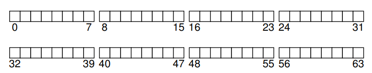

我们需要在磁盘上存储用户数据，实际上一个文件系统的大部分区域都应该用于存储用户数据，我们将这部分区域称为数据区域 `data region`。此外，对于每个文件，我们需要存储其相关的信息，也就是元数据。我们通常用 `inode` 结构来存储这些元数据，我们将这部分区域称为 `inode` 表 `inode table`。此时，磁盘的划分如下：

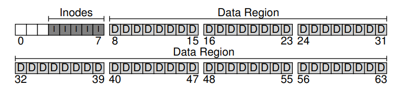

每个 `inode` 只需要占有 `128` 或 `256` 字节的空间，假设每个 `inode` 的大小为 `256` 字节，那么 `4KB` 的 `block` 就可以存储 `16` 个 `inode`。这里我们存储 `inode` 的块有 `5` 个，存储 `data` 的块有 `56` 个

此时，我们拥有了数据块和 `inode` 块，我们还需要一个结构来表示每个数据块或 `inode` 块是否已经分配。我们选择一个最简单的结构：位图 `bitmap` 来表示。`bitmap` 的每一位都可以表示对应的对象是空闲 `0` 还是正在使用 `1`

那么 `bitmap` 占用了两个块，剩下一个为 `superblock`，用于存储该文件系统的相关信息。例如文件系统中有多少个 `inode` 和数据块；`inode` 表的起始地址是多少；`data region` 的起始地址是多少。那么此时文件系统的划分如下：


> 需要在此说明的是，我们常说一个文件的 `inode` 号 `inode number`，那个实际上是该文件低级名称的一种指代。实际上，只要直到该文件的低级名称，我们便可以知道该文件存储在哪个 `inode` 结构中。`inode number` 实际上是 `inode table` 的下标
>
> 我们假设磁盘的扇区大小为 `sectorSize`，那么 `inumber` 对应的 `inode` 结构存储的扇区便可以计算出来：
>
> ```
> sector=((inumber * sizeof(inode_t)) + inodeStartAddr) / sectorSize
> ```

### Inode Structure

`inode` 的结构如下图所示：

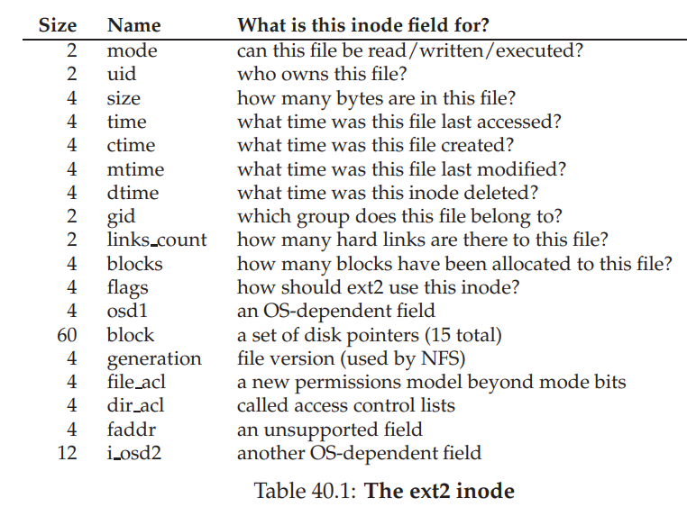

这里面最关键的问题是**如何引用数据块的位置**。`inode` 的设计中有固定数量的之间指针（如 `12` 个）和一个间接指针 `indirect pointer`。每个直接指针都会指向一个数据块，而间接指针则会指向一个间接块（来自磁盘的数据区域，但该块的内容全部都是直接指针）

按照这种设想，我们假设一个 `block` 的大小为 `4KB`，磁盘地址为 `4` 字节，那么一个间接块内有 $1024$ 个直接指针。那么直接指针所能表示的最大大小为：$12\times 4\rm KB=64KB$；间接指针所能表示的大小为：$1024\times \rm 4KB=4096KB$

如果我们希望支持更大的文件，还可以增加双重间接指针 `double indirect pointer`，那么我们便可以在原先的基础上增加 $1024\times 1024$ 个指针来指向数据块，因此支持的文件大小变为 $(12+1024+1024^2)\times 4\rm KB$ ，这刚好可以容纳一个超过 `4GB` 的文件

### Access Path

#### Read File

一个文件的读取和写入所产生的 `I/O` 成本是非常高昂的，我们考虑一个读取的例子

假设要读取文件 `/foo/bar`，我们假设该文件的大小为 `4KB`，也就是一个 `block`

为了读取该文件，文件系统需要首先找到该文件的 `inode` 结构，但由于文件系统现在只有路径名，因此它需要遍历这个路径名

首先文件系统从根目录 `root directory` 开始（根目录的 `inode number` 是总所周知的，在 `UNIX` 系统中一般为 `2`），文件系统首先读取根目录的 `inode` 结构，然后查找其指向数据块的指针，然后通过这些指针在磁盘上读取内容。换句话说，文件系统会遍历根目录中的所有内容（文件的高级名称和文件的低级名称的映射），进而找到 `foo` 的条目

下一步，文件系统会读取 `foo` 的 `inode` 结构和其目录的数据块，在此数据块中找到 `bar` 的 `inode` 结构，进而可以通过 `bar` 的 `inode` 结构找到 `bar` 文件的数据块

这一切都结束后，文件系统将 `inode` 结构读入内存，对权限进行检查，在每个进程的文件表中为该进程分配一个文件描述符并返回给用户

我们回顾这个过程，为了读取一个文件，我们需要依次遍历该路径上的所有目录的内容（先找到该目录的 `inode` 结构，然后在遍历器内容），也就是说**打开文件所导致的 `I/O` 量与路径的长度成正比**

当我们关闭一个文件，则不需要做任何的 `I/O`，只需要将文件描述符关闭即可

读取一个文件的具体过程如下所示（时间向下增长）：

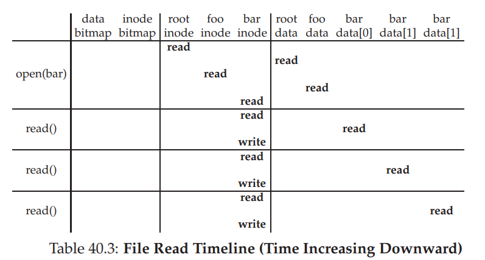

#### Write File

写入一个文件也是类似的过程，但这个过程所造成的 `I/O` 比读取要大得多。这是因为，写入操作不仅需要将数据写入磁盘，还有可能会分配一个新的块。为了决定将哪个块分配给该文件，那么就需要读取 `inode` 结构和 `data bitmap`

逻辑上，每次写入文件都会导致 `5` 个 `I/O`：一次读取 `data bitmap`（用于分配新的块给该文件），一次写入 `data bitmap`（选择具体分配哪个块），一次读取 `inode` 结构，一次写入 `inode` 结构（更新文件的状态），最后才是实际写入内容本身

如果我们需要创建一个文件，所需要的 `I/O` 开销依然很大：为了创建一个新文件，文件系统不仅要分配一个 `inode` 结构，还需要在新文件所关联的所有目录。具体地，我们需要读取一个 `inode bitmap`（查找空闲 `inode`），写入一个 `inode bitmap`，写入一个新的 `inode` 结构（初始化该文件的元数据），还需要写入一系列目录更新的数据，所有的这一切仅仅是为了创建一个文件

还是刚才的例子，我们对文件 `/foo/bar` 写入 `3` 个块，具体如下图：

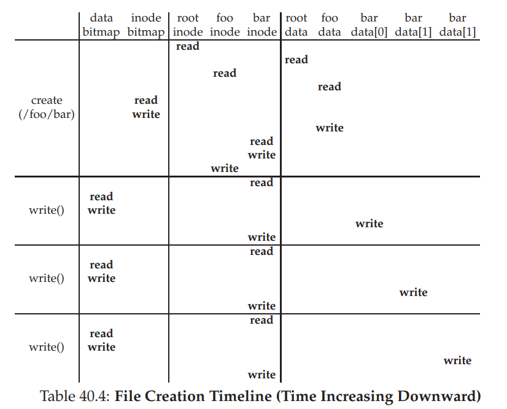

我们看到，在文件创建的时候，执行了 `10` 次 `I/O`，而后续的每次写入，都执行了 `5` 次 `I/O`

### Cache & Buffer

由于对文件的读取和写入所造成的 `I/O` 实在是过大，因此现代操作系统通常会将一写经常访问到的 `inode` 结构缓存 `cache` 起来，这样可以加快访问速度

除此之外，对于文件的写入也有加速手段，这便是写缓冲 `write buffer`。通过延迟写入，文件系统可以减少一定的 `I/O` 量。例如，如果创建了一个文件然后将其删除，那么延迟写入便可以省略掉这部分的 `I/O`

基于这些原因，现代文件系统会将写入在内存中缓存 `5s` 到 `30s`，然后再进行写入。这是一种折中：如果在更新传递到磁盘之前文件系统崩溃，那么更新便会丢失。但，由于文件系统实在是过于缓慢，我们只能用这种牺牲可靠性的方式换取速度

